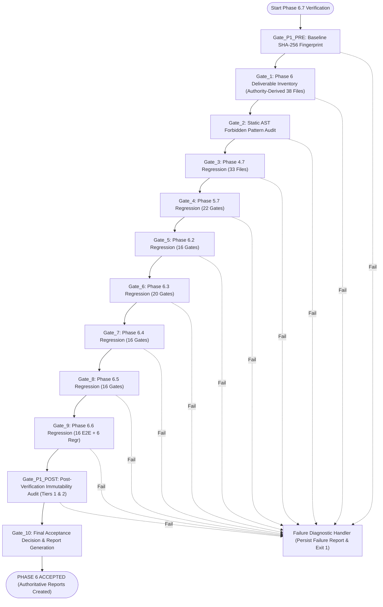

# NexThreat — Phase 6.7 Implementation Plan
# Final Phase 6 Acceptance & System Hardening Specification

```text
================================================================================
NEXTHREAT SECURE NETWORK TELEMETRY THREAT-DETECTION PLATFORM
PHASE 6.7 — FINAL ACCEPTANCE & SYSTEM HARDENING IMPLEMENTATION PLAN
DOCUMENT VERSION : 1.5.0
PREVIOUS VERSION : 1.4.0
TIMESTAMP        : 2026-09-20T12:15:00+05:30
GOVERNANCE STATE : PLAN ONLY — IMPLEMENTATION NOT AUTHORIZED
BASELINE COMMIT  : 9aa4d78afc0d2d29fd7a49a104aa4acb7f5acc36 (Phase 6.5)
CURRENT COMMIT   : c2e034f610b968c5f0d4c67e248506394584efde (Phase 6.6 Accepted)
AUTHORITY SOURCE : PHASE 6.1 ARCHITECTURE (SECS 2 & 25), PHASE 6.6 PLAN (SEC 17)
REPOSITORY ROOT  : E:\Project\NexThreat
================================================================================
```

---

## 1. Executive Summary

- **VERIFIED FACT**: NexThreat has successfully completed and accepted subphases 6.1 through 6.6 under the strict governing principle:
  > *"Phase 6 exposes NexThreat; Phase 6 does not redefine NexThreat."*
- **AUTHORITY**: In accordance with the foundational architecture specification in [`phase_6_1_api_backend_architecture_and_contract.md`](file:///e:/Project/NexThreat/data/model_reports/application/phase_6_1_api_backend_architecture_and_contract.md#L38-L48) (Sections 2 and 25) and [`phase_6_6_api_e2e_verification_and_regression_implementation_plan.md`](file:///e:/Project/NexThreat/data/model_reports/application/phase_6_6_api_e2e_verification_and_regression_implementation_plan.md#L546-L553) (Section 17), Phase 6.7 is designated as:
  **"Phase 6.7 — Final Phase 6 Acceptance & Hardening"**.
- **INFERENCE**: Prior major phases established that major project stages culminate in an authoritative `.7` hardening, immutability, and final acceptance gate ([Phase 4.7](file:///e:/Project/NexThreat/outputs/reports/phase_4_7_acceptance_report.md) for ML Core; [Phase 5.7](file:///e:/Project/NexThreat/outputs/reports/phase_5_7_final_acceptance_report.md) for Application Integration Layer). Phase 6.7 fulfills this exact role for the entire Phase 6 API exposure stack.
- **OBJECTIVE**: This document defines the formal, deterministic, read-only verification harness and governance procedures required to evaluate the complete Phase 6 implementation, execute static AST forbidden-pattern audits, run full cross-phase regressions across Phases 4.7, 5.7, and 6.2–6.6, enforce strict pre- and post-verification cryptographic immutability, and issue the final project-level certification: **`PHASE 6 ACCEPTED`**.

---

## 2. Governance Status

```text
================================================================================
GOVERNANCE DIRECTIVE:
PLAN ONLY — IMPLEMENTATION NOT AUTHORIZED
================================================================================
This document is an architectural and verification specification ONLY.
Implementation authorization is strictly WITHHELD.
No code, verifier scripts, or acceptance reports may be generated or modified
until this plan has undergone formal audit and explicit user authorization.
================================================================================
```

---

## 3. Authority & Preconditions

### 3.1 Scope Audit Precondition
- **VERIFIED FACT**: The formal Phase 6.7 Scope & Authority Audit concluded with the verdict:
  `SCOPE AUDIT PASSED — PHASE 6.7 PLAN NOT YET CREATED`.
- **AUTHORITY**: The audit established that Phase 6.7 is contractually mandated and strictly confined to acceptance, hardening, and regression verification without any runtime modifications.

### 3.2 Preceding Phase Completion
- **VERIFIED FACT**: Phase 6.6 was formally accepted at commit `c2e034f610b968c5f0d4c67e248506394584efde` with 16/16 E2E acceptance gates passing and 6/6 multi-phase upstream regressions passing on single deterministic attempts with zero retries.

### 3.3 Clean Working Tree Precondition
- **VERIFIED FACT**: The repository working tree must be completely clean with zero uncommitted modifications and zero untracked runtime files prior to any Phase 6.7 execution.

### 3.4 Cryptographic Baseline Authority
- **AUTHORITY**: The 33 authoritative frozen Phase 4 artifacts defined in the Phase 4.7 manifest ([`phase_4_7_acceptance_report.md`](file:///e:/Project/NexThreat/outputs/reports/phase_4_7_acceptance_report.md)) remain the absolute immutable baseline for model weights, scalers, decision thresholds, and metadata.

---

## 4. Phase 6.7 Objectives

The authorized objectives for Phase 6.7 are strictly limited to:

1. **Pre-Verification Immutability Fingerprinting**: Compute and verify SHA-256 digests of all 33 frozen Phase 4 artifacts before any test execution.
2. **Phase 6 Authoritative Inventory Audit**: Verify the physical presence, readability, and structural conformity of all 38 authoritative deliverables derived from accepted Phase 6.1 through Phase 6.6 artifacts.
3. **Static AST & Forbidden-Pattern Audit**: Statically verify, within the explicitly defined AST rule set, that zero prohibited syntactic constructs are present in production Python source files in [`src/api/`](file:///e:/Project/NexThreat/src/api):
   - Prohibited model imports or model weight loading calls in the API transport layer.
   - Numerical score fusion, weighted blending, voting, or composite scoring.
   - Threshold mutation or scaler alterations.
   - Unauthorized model training, refitting, parameter mutation, or estimator re-training contexts.
   - Ensemble or meta-model abstractions.
   - Autonomous remediation, system commands, or firewall modifications.
   - Technical information leakage or unsanitized stack trace exposures in client-facing error envelopes.
   - Unauthorized reset endpoints or hidden bypass mechanisms.
4. **Comprehensive Cross-Phase Regression Execution**: Deterministically execute the regression suites of all preceding accepted phases (4.7, 5.7, 6.2, 6.3, 6.4, 6.5, 6.6) with zero retries and single-attempt enforcement.
5. **Post-Verification Immutability Audit**: Re-verify cryptographic SHA-256 hashes of all frozen assets across designated tiers to verify zero state contamination or unauthorized filesystem mutation occurred during verification.
6. **Final Acceptance Decision & Sealing**: Synthesize all gate results and generate the authoritative JSON and Markdown acceptance reports, formally certifying **`PHASE 6 ACCEPTED`** (or emitting structured failure diagnostics if any gate fails).

---

## 5. Explicit Non-Objectives

The following activities are strictly **PROHIBITED** and **OUT OF SCOPE** for Phase 6.7:

- **NO Feature Development**: Adding new API features, options, or endpoints.
- **NO Runtime Code Modifications**: Editing [`src/api/*.py`](file:///e:/Project/NexThreat/src/api) or [`src/application/*.py`](file:///e:/Project/NexThreat/src/application).
- **NO Model Modifications**: Altering weights, hyper-parameters, thresholds, or retraining Autoencoder, XGBoost, or LSTM models.
- **NO Feature Engineering**: Deriving, transforming, or reordering the 13 canonical features.
- **NO Threat State Alteration**: Expanding or modifying the bijective $S_0$–$S_7$ threat taxonomy.
- **NO Autonomous Remediation**: Adding firewall modification, IP blocking, or host isolation.
- **NO Packaging Redesign**: Changing [`Dockerfile`](file:///e:/Project/NexThreat/Dockerfile), [`docker-compose.yml`](file:///e:/Project/NexThreat/docker-compose.yml), or [`requirements.lock`](file:///e:/Project/NexThreat/requirements.lock).
- **NO Phase 7 Scope Creep**: Implementing web dashboards, cloud provisioning, Kubernetes charts, or SIEM forwarders.
- **NO Upstream Artifact Mutations**: Modifying accepted verification reports or verification scripts from prior phases.

---

## 6. Deliverables

Phase 6.7 defines **exactly three authoritative deliverables** upon execution authorization:

### 6.1 Verification Harness Tooling (Authoritative Deliverable 1)
- **Path**: [`src/api/verification/verify_phase_6_7.py`](file:///e:/Project/NexThreat/src/api/verification/verify_phase_6_7.py)
- **Role**: Standalone, deterministic, read-only Python verification suite implementing all 12 Phase 6.7 acceptance gates.

### 6.2 Machine-Readable Acceptance Report (Authoritative Deliverable 2)
- **Path**: [`data/model_reports/application/phase_6_7_final_acceptance_report.json`](file:///e:/Project/NexThreat/data/model_reports/application/phase_6_7_final_acceptance_report.json)
- **Role**: Primary authoritative JSON report containing timestamp, commit hashes, per-gate status, attempt counts, execution metrics, and cryptographic inventories.

### 6.3 Human-Readable Acceptance Report (Authoritative Deliverable 3)
- **Path**: [`data/model_reports/application/phase_6_7_final_acceptance_report.md`](file:///e:/Project/NexThreat/data/model_reports/application/phase_6_7_final_acceptance_report.md)
- **Role**: Primary authoritative Markdown report documenting executive findings, gate verification matrices, regression results, immutability audit tables, and the final Phase 6 acceptance declaration.

### 6.4 Classification of Derived Publication Copy (Non-Authoritative)
- **Path**: [`outputs/reports/phase_6_7_final_acceptance_report.md`](file:///e:/Project/NexThreat/outputs/reports/phase_6_7_final_acceptance_report.md)
- **Classification**: **DERIVED PUBLICATION COPY — NOT AN AUTHORITATIVE PHASE 6.7 DELIVERABLE**.
- **Role**: Following project-wide convention established in Phase 4.7 and Phase 5.7, an exact, byte-for-byte copy of the primary authoritative Markdown report is published to `outputs/reports/` for reporting parity. It is strictly a derived distribution mirror and does not constitute a fourth authoritative deliverable.

---

## 7. Verification Architecture

The Phase 6.7 verification harness (`verify_phase_6_7.py`) must conform to the following architectural invariants:

1. **Zero-Retry Policy**: Every acceptance gate and upstream regression must execute strictly once. The verifier must record `attempts = 1` for each gate. Any failure triggers an immediate fail-fast exit.
2. **Read-Only Operation**: Verification operates in strict read-only mode against production assets. Filesystem write permissions are limited exclusively to outputting the authoritative acceptance report files.
3. **No Arbitrary Sleeps**: Verification logic must avoid arbitrary time sleeps (`time.sleep`) as workarounds for concurrency or timing. Explicit readiness polling with timeouts or condition synchronization must be used where necessary.
4. **Deterministic Sequential Execution**: Gates execute in strict sequential order to prevent thread interference, socket collisions, or race conditions.
5. **Fail-Fast Boundary**: If any gate fails, subsequent gates are aborted immediately.
6. **Isolated Subprocess Regression Invocation**: Upstream regression scripts must be invoked in clean Python subprocesses with the project root set in `sys.path`, preventing module pollution or shared static state.

---

## 8. Gate Architecture

The Phase 6.7 acceptance framework is structured into exactly 12 deterministic gates in strict sequential order:

| Gate Identifier | Gate Name | Category | Primary Invariant Verified |
| :--- | :--- | :--- | :--- |
| **`Gate_P1_PRE`** | Pre-Verification Cryptographic Baseline | Cryptographic Audit | 33 / 33 Phase 4 frozen artifacts match authoritative SHA-256 hashes |
| **`Gate_1`** | Phase 6 Authoritative Deliverable Inventory | Inventory Audit | Validate authority from accepted phase artifacts and verify 38/38 deliverables |
| **`Gate_2`** | Static AST Forbidden-Pattern Audit | Static Analysis | Statically verify zero prohibited syntactic patterns within defined rule set |
| **`Gate_3`** | Phase 4.7 Regression Verification | Upstream Regression | Phase 4 ML core regression (33/33 files, 14 pillars PASS) |
| **`Gate_4`** | Phase 5.7 Regression Verification | Upstream Regression | Phase 5 application integration regression (22/22 gates PASS) |
| **`Gate_5`** | Phase 6.2 Regression Verification | Upstream Regression | Phase 6.2 schemas & validators regression (16/16 gates PASS) |
| **`Gate_6`** | Phase 6.3 Regression Verification | Upstream Regression | Phase 6.3 HTTP transport handlers regression (20/20 gates PASS) |
| **`Gate_7`** | Phase 6.4 Regression Verification | Upstream Regression | Phase 6.4 OpenAPI & operational docs regression (16/16 gates PASS) |
| **`Gate_8`** | Phase 6.5 Regression Verification | Upstream Regression | Phase 6.5 packaging & containerization regression (16/16 gates PASS) |
| **`Gate_9`** | Phase 6.6 Regression Verification | Upstream Regression | Phase 6.6 E2E integration & concurrency regression (16/16 E2E PASS) |
| **`Gate_P1_POST`** | Post-Verification Immutability Audit | Cryptographic Audit | Re-verify Tier 1 & Tier 2 assets; verify zero unauthorized repository mutations |
| **`Gate_10`** | Final Phase 6 Acceptance Decision | Acceptance Engine | All 11 prior gates PASS; formal issuance of **`PHASE 6 ACCEPTED`** |

---

## 9. Gate_P1_PRE — Pre-Verification Cryptographic Baseline

### 9.1 Objective
Establish an uncompromised cryptographic baseline before any regression or test code is executed, ensuring that the 33 authoritative Phase 4 artifacts have not suffered bit rot or tampering.

### 9.2 Audit Procedure
1. Load the authoritative Phase 4.7 manifest from [`data/model_reports/application/phase_4_7_acceptance_report.json`](file:///e:/Project/NexThreat/data/model_reports/application/phase_4_7_acceptance_report.json) or [`src/application/service.py`](file:///e:/Project/NexThreat/src/application/service.py).
2. Extract the exact list of 33 relative file paths and their expected SHA-256 hexadecimal digests.
3. Compute the SHA-256 digest of each file on disk using 64 KB buffer chunks.
4. Compare actual SHA-256 against expected SHA-256 case-insensitively.

### 9.3 Acceptance Criteria
- Verified file count must equal exactly 33.
- Mutation count must equal exactly 0.
- Missing file count must equal exactly 0.
- Any mismatch aborts execution immediately.

---

## 10. Gate_1 — Phase 6 Authoritative Deliverable Inventory

### 10.1 Authoritative Inventory Rule
> **Authoritative Inventory Rule**: A Phase 6 file is included in the Gate 1 authoritative inventory only when the corresponding accepted Phase 6 phase artifact explicitly identifies that file as an accepted deliverable or authoritative artifact. Repository presence alone does not establish authority.

The plan strictly distinguishes:
- **Authoritative Asset**: A file explicitly identified by the corresponding accepted phase artifact as an accepted deliverable or authoritative artifact.
- **Non-Authoritative Asset**: A file that merely exists in the repository (e.g., untracked scratch files, temporary logs, or compilation caches) but is not identified by the corresponding accepted phase artifact.

### 10.2 Authority Derivation Implementation Behavior
The 38-file inventory table below represents the **expected inventory reference**. It is **NOT** an independent source of authority.
During execution, `verify_phase_6_7.py` must:
1. Load and parse the deliverable manifests from the accepted Phase 6 subphase artifacts (`phase_6_1_api_backend_architecture_and_contract.md`, `phase_6_2_final_acceptance_report.md`, `phase_6_3_verification_report.md`, `phase_6_4_verification_report.md`, `phase_6_5_verification_report.md`, and `phase_6_6_verification_report.md`).
2. Dynamically determine the set of authoritative files established by those accepted artifacts.
3. Compare the authority-derived set against the expected 38-file inventory reference.
4. Fail immediately if there is a missing authoritative file, an unexpected file, an inventory count mismatch, or an authority mapping inconsistency.

### 10.3 Phase Authority Mapping Reference

| Subphase Source | Authorizing Phase Artifact | Authoritative Delivered Files Established by Artifact |
| :--- | :--- | :--- |
| **Phase 6.1** | [`phase_6_1_api_backend_architecture_and_contract.md`](file:///e:/Project/NexThreat/data/model_reports/application/phase_6_1_api_backend_architecture_and_contract.md) | `data/model_reports/application/phase_6_1_api_backend_architecture_and_contract.md` |
| **Phase 6.2** | [`phase_6_2_final_acceptance_report.md`](file:///e:/Project/NexThreat/data/model_reports/application/phase_6_2_final_acceptance_report.md) | `src/api/__init__.py`, `src/api/schemas.py`, `src/api/validators.py`, `src/api/exceptions.py`, `src/api/verification/__init__.py`, `src/api/verification/verify_phase_6_2.py`, `data/model_reports/application/phase_6_2_request_response_schemas_and_validation_implementation_plan.md`, `data/model_reports/application/phase_6_2_final_acceptance_and_hardening_plan.md`, `data/model_reports/application/phase_6_2_final_acceptance_report.md`, `data/model_reports/application/phase_6_2_final_acceptance_report.json` |
| **Phase 6.3** | [`phase_6_3_verification_report.md`](file:///e:/Project/NexThreat/data/model_reports/application/phase_6_3_verification_report.md) | `src/api/handlers.py`, `src/api/server.py`, `src/api/verification/verify_phase_6_3.py`, `data/model_reports/application/phase_6_3_api_endpoint_integration_and_transport_handlers_implementation_plan.md`, `data/model_reports/application/phase_6_3_verification_report.md`, `data/model_reports/application/phase_6_3_verification_report.json` |
| **Phase 6.4** | [`phase_6_4_verification_report.md`](file:///e:/Project/NexThreat/data/model_reports/application/phase_6_4_verification_report.md) | `docs/api/openapi.json`, `docs/api/api_integration_guide.md`, `docs/api/operational_runbook.md`, `docs/api/integration_examples.json`, `src/api/verification/verify_phase_6_4.py`, `data/model_reports/application/phase_6_4_api_documentation_and_contract_specification_plan.md`, `data/model_reports/application/phase_6_4_verification_report.md`, `data/model_reports/application/phase_6_4_verification_report.json` |
| **Phase 6.5** | [`phase_6_5_verification_report.md`](file:///e:/Project/NexThreat/data/model_reports/application/phase_6_5_verification_report.md) | `Dockerfile`, `docker-compose.yml`, `.dockerignore`, `requirements.lock`, `src/api/entrypoint.py`, `src/api/verification/verify_phase_6_5.py`, `data/model_reports/application/phase_6_5_production_packaging_containerization_implementation_plan.md`, `data/model_reports/application/phase_6_5_verification_report.md`, `data/model_reports/application/phase_6_5_verification_report.json` |
| **Phase 6.6** | [`phase_6_6_verification_report.md`](file:///e:/Project/NexThreat/data/model_reports/application/phase_6_6_verification_report.md) | `src/api/verification/verify_phase_6_6.py`, `data/model_reports/application/phase_6_6_api_e2e_verification_and_regression_implementation_plan.md`, `data/model_reports/application/phase_6_6_verification_report.md`, `data/model_reports/application/phase_6_6_verification_report.json` |

### 10.4 Expected Inventory Reference Matrix (38 Assets)

#### A. API Source Modules (`src/api/` — 7 Files)
1. [`src/api/__init__.py`](file:///e:/Project/NexThreat/src/api/__init__.py)
2. [`src/api/exceptions.py`](file:///e:/Project/NexThreat/src/api/exceptions.py)
3. [`src/api/schemas.py`](file:///e:/Project/NexThreat/src/api/schemas.py)
4. [`src/api/validators.py`](file:///e:/Project/NexThreat/src/api/validators.py)
5. [`src/api/handlers.py`](file:///e:/Project/NexThreat/src/api/handlers.py)
6. [`src/api/server.py`](file:///e:/Project/NexThreat/src/api/server.py)
7. [`src/api/entrypoint.py`](file:///e:/Project/NexThreat/src/api/entrypoint.py)

#### B. API Verification Tooling (`src/api/verification/` — 6 Files)
8. [`src/api/verification/__init__.py`](file:///e:/Project/NexThreat/src/api/verification/__init__.py)
9. [`src/api/verification/verify_phase_6_2.py`](file:///e:/Project/NexThreat/src/api/verification/verify_phase_6_2.py)
10. [`src/api/verification/verify_phase_6_3.py`](file:///e:/Project/NexThreat/src/api/verification/verify_phase_6_3.py)
11. [`src/api/verification/verify_phase_6_4.py`](file:///e:/Project/NexThreat/src/api/verification/verify_phase_6_4.py)
12. [`src/api/verification/verify_phase_6_5.py`](file:///e:/Project/NexThreat/src/api/verification/verify_phase_6_5.py)
13. [`src/api/verification/verify_phase_6_6.py`](file:///e:/Project/NexThreat/src/api/verification/verify_phase_6_6.py)

#### C. Packaging & Containerization (Project Root — 4 Files)
14. [`Dockerfile`](file:///e:/Project/NexThreat/Dockerfile)
15. [`docker-compose.yml`](file:///e:/Project/NexThreat/docker-compose.yml)
16. [`.dockerignore`](file:///e:/Project/NexThreat/.dockerignore)
17. [`requirements.lock`](file:///e:/Project/NexThreat/requirements.lock)

#### D. API Documentation & OpenAPI Specification (`docs/api/` — 4 Files)
18. [`docs/api/openapi.json`](file:///e:/Project/NexThreat/docs/api/openapi.json)
19. [`docs/api/api_integration_guide.md`](file:///e:/Project/NexThreat/docs/api/api_integration_guide.md)
20. [`docs/api/operational_runbook.md`](file:///e:/Project/NexThreat/docs/api/operational_runbook.md)
21. [`docs/api/integration_examples.json`](file:///e:/Project/NexThreat/docs/api/integration_examples.json)

#### E. Phase 6 Plans & Verification Reports (`data/model_reports/application/` — 17 Files)
22. [`data/model_reports/application/phase_6_1_api_backend_architecture_and_contract.md`](file:///e:/Project/NexThreat/data/model_reports/application/phase_6_1_api_backend_architecture_and_contract.md)
23. [`data/model_reports/application/phase_6_2_request_response_schemas_and_validation_implementation_plan.md`](file:///e:/Project/NexThreat/data/model_reports/application/phase_6_2_request_response_schemas_and_validation_implementation_plan.md)
24. [`data/model_reports/application/phase_6_2_final_acceptance_and_hardening_plan.md`](file:///e:/Project/NexThreat/data/model_reports/application/phase_6_2_final_acceptance_and_hardening_plan.md)
25. [`data/model_reports/application/phase_6_2_final_acceptance_report.md`](file:///e:/Project/NexThreat/data/model_reports/application/phase_6_2_final_acceptance_report.md)
26. [`data/model_reports/application/phase_6_2_final_acceptance_report.json`](file:///e:/Project/NexThreat/data/model_reports/application/phase_6_2_final_acceptance_report.json)
27. [`data/model_reports/application/phase_6_3_api_endpoint_integration_and_transport_handlers_implementation_plan.md`](file:///e:/Project/NexThreat/data/model_reports/application/phase_6_3_api_endpoint_integration_and_transport_handlers_implementation_plan.md)
28. [`data/model_reports/application/phase_6_3_verification_report.md`](file:///e:/Project/NexThreat/data/model_reports/application/phase_6_3_verification_report.md)
29. [`data/model_reports/application/phase_6_3_verification_report.json`](file:///e:/Project/NexThreat/data/model_reports/application/phase_6_3_verification_report.json)
30. [`data/model_reports/application/phase_6_4_api_documentation_and_contract_specification_plan.md`](file:///e:/Project/NexThreat/data/model_reports/application/phase_6_4_api_documentation_and_contract_specification_plan.md)
31. [`data/model_reports/application/phase_6_4_verification_report.md`](file:///e:/Project/NexThreat/data/model_reports/application/phase_6_4_verification_report.md)
32. [`data/model_reports/application/phase_6_4_verification_report.json`](file:///e:/Project/NexThreat/data/model_reports/application/phase_6_4_verification_report.json)
33. [`data/model_reports/application/phase_6_5_production_packaging_containerization_implementation_plan.md`](file:///e:/Project/NexThreat/data/model_reports/application/phase_6_5_production_packaging_containerization_implementation_plan.md)
34. [`data/model_reports/application/phase_6_5_verification_report.md`](file:///e:/Project/NexThreat/data/model_reports/application/phase_6_5_verification_report.md)
35. [`data/model_reports/application/phase_6_5_verification_report.json`](file:///e:/Project/NexThreat/data/model_reports/application/phase_6_5_verification_report.json)
36. [`data/model_reports/application/phase_6_6_api_e2e_verification_and_regression_implementation_plan.md`](file:///e:/Project/NexThreat/data/model_reports/application/phase_6_6_api_e2e_verification_and_regression_implementation_plan.md)
37. [`data/model_reports/application/phase_6_6_verification_report.md`](file:///e:/Project/NexThreat/data/model_reports/application/phase_6_6_verification_report.md)
38. [`data/model_reports/application/phase_6_6_verification_report.json`](file:///e:/Project/NexThreat/data/model_reports/application/phase_6_6_verification_report.json)

### 10.5 Acceptance Criteria
- Exact dynamic match between the authority-derived inventory and the 38-file reference set.
- All 38 files verified present, readable, and non-empty (> 0 bytes).
- Zero unexpected substitutions, missing files, or authority discrepancies.

---

## 11. Gate_2 — Static AST / Forbidden Pattern Audit

### 11.1 Objective & Distinction of Verification Boundaries
Statically verify, within the explicitly defined AST rule set, that zero prohibited syntactic constructs are present in production Python source files in [`src/api/`](file:///e:/Project/NexThreat/src/api) (excluding test/verification scripts).

**Verification Boundary Distinction**:
- **AST-Verifiable Properties**: Syntactic presence of prohibited module imports, direct model weight loading calls, prohibited remediation commands, threshold assignment mutations, and traceback formatting calls.
- **Properties Requiring Runtime Regression Verification**: Numerical precision, decision operator logic ($P \ge 0.3000$), state machine transitions, lookback buffer purging, concurrent request synchronization, and payload byte ceilings. These behavioral properties are verified dynamically by Gates 3 through 9.

### 11.2 Contextual AST Evaluation Rules
The AST auditor parses each `.py` file under `src/api/` using Python's `ast` module and inspects nodes against the following contextual rules:

1. **Direct Model Import Prohibition**:
   - `ast.Import` and `ast.ImportFrom` nodes must NOT import `tensorflow`, `keras`, `xgboost`, `sklearn`, `torch`, or `scipy.optimize`.
   - Reason: The API layer must delegate exclusively to the Phase 5 `ApplicationInferenceEngine`.
2. **Prohibited Model File Loading**:
   - `ast.Call` nodes must NOT call functions loading `.h5`, `.json`, `.joblib`, `.pt`, or `.onnx` weight artifacts directly within API handlers.
3. **Score Fusion / Weighted Blending Prohibition**:
   - Zero arithmetic blending, linear combination, or voting across model probabilities in the API layer.
4. **Frozen Threshold Mutation Prohibition**:
   - `ast.Assign` targets must NOT mutate frozen thresholds (`AUTOENCODER_THRESHOLD` or `LSTM_THRESHOLD`).
5. **Contextual Model Training / Retraining Prohibition**:
   - The AST auditor inspects `ast.Call` nodes for method calls (`fit`, `fit_transform`, `partial_fit`, `train`).
   - The rule contextually identifies calls associated with ML model training, refitting, parameter mutation, or estimator retraining.
   - It does NOT naively flag non-ML uses (such as string formatting, geometric fitting, or unrelated container operations) if any were present. The rule targets: **ZERO UNAUTHORIZED MODEL TRAINING**.
6. **Ensemble / Meta-Model Prohibition**:
   - Zero instantiation of meta-classifiers or ensemble wrappers.
7. **Autonomous Remediation & Execution Prohibition**:
   - Prohibit calls to `os.system`, `subprocess.Popen`, `subprocess.run`, `subprocess.call` in request handlers and validators.
   - Prohibit command strings referencing `iptables`, `nftables`, `ufw`, `firewall-cmd`, `route add`, `kill`.
8. **Raw Socket Manipulation Prohibition**:
   - Sockets must only use standard Python `http.server` or `socketserver` abstractions. Zero `socket.SOCK_RAW` or promiscuous sniffing logic.
9. **Technical Traceback & Path Leakage Redaction**:
   - Audit [`src/api/exceptions.py`](file:///e:/Project/NexThreat/src/api/exceptions.py) to certify that error envelope formatting suppresses `traceback.format_exc()`, local file paths, and memory addresses from client responses.
10. **Reset Endpoint Prohibition**:
    - Handlers must explicitly return HTTP 404 for `/api/v1/reset` or `/reset`, with zero internal state-clearing bypasses.

### 11.3 Acceptance Criteria
- Total AST violations detected: **0**.

---

## 12. Gate_3 — Phase 4.7 Regression

### 12.1 Objective
Execute the accepted Phase 4.7 verification suite to verify the ongoing mathematical and structural integrity of the ML model core.

### 12.2 Invocation Command
```bash
python -m src.models.verification.verify_phase_4_7
```

### 12.3 Authoritative Acceptance Target
- **VERIFIED FACT**: From [`phase_4_7_acceptance_report.md`](file:///e:/Project/NexThreat/outputs/reports/phase_4_7_acceptance_report.md):
  * Total Pillars: 14 evaluated.
  * Pillars Passed: 14 / 14 (100%).
  * Phase 4.5 Regression Suite: PASS.
  * Phase 4.6 Hardening Suite: PASS.
  * 33-File Immutability: PASS.
  * Verdict: **`PHASE 4 = ACCEPTED`**.

---

## 13. Gate_4 — Phase 5.7 Regression

### 13.1 Objective
Execute the accepted Phase 5.7 verification suite to verify the application integration, temporal state manager, alert dispatcher, and orchestrator.

### 13.2 Invocation Command
```bash
python -m src.application.verification.verify_phase_5_7
```

### 13.3 Authoritative Acceptance Target
- **VERIFIED FACT**: From [`phase_5_7_final_acceptance_report.md`](file:///e:/Project/NexThreat/outputs/reports/phase_5_7_final_acceptance_report.md):
  * Functional Gates Evaluated: 22 / 22 Passed.
  * Baseline 33-File SHA-256 Audit: PASS.
  * Post-Verification Immutability: PASS.
  * Verdict: **`PHASE 5 = ACCEPTED`**.

---

## 14. Gate_5 — Phase 6.2 Regression

### 14.1 Objective
Execute the accepted Phase 6.2 verification suite to confirm that Pydantic/dataclass request schemas, 24-field response schemas, input boundaries, and error sanitizers remain intact.

### 14.2 Invocation Command
```bash
python -m src.api.verification.verify_phase_6_2
```

### 14.3 Authoritative Acceptance Target
- **VERIFIED FACT**: From [`phase_6_2_final_acceptance_report.md`](file:///e:/Project/NexThreat/data/model_reports/application/phase_6_2_final_acceptance_report.md):
  * Total Verification Gates: 16 / 16 Passed.
  * Upstream Regression: Phase 4 (33/33) and Phase 5 (22/22) PASS.
  * Verdict: **`PASS`**.

---

## 15. Gate_6 — Phase 6.3 Regression

### 15.1 Objective
Execute the accepted Phase 6.3 verification suite to confirm HTTP transport handlers, server lifecycle management, endpoint routing, and content negotiation.

### 15.2 Invocation Command
```bash
python -m src.api.verification.verify_phase_6_3
```

### 15.3 Authoritative Acceptance Target
- **VERIFIED FACT**: From [`phase_6_3_verification_report.md`](file:///e:/Project/NexThreat/data/model_reports/application/phase_6_3_verification_report.md):
  * Total Acceptance Gates: 20 / 20 Passed.
  * Retries: 0 (deterministic single execution enforced).
  * Upstream Regression: Phase 4, Phase 5, Phase 6.2 PASS.
  * Verdict: **`ACCEPTED & FULLY VERIFIED`**.

---

## 16. Gate_7 — Phase 6.4 Regression

### 16.1 Objective
Execute the accepted Phase 6.4 verification suite to confirm OpenAPI 3.1.0 specification validity, integration guides, operational runbooks, and canonical examples.

### 16.2 Invocation Command
```bash
python -m src.api.verification.verify_phase_6_4
```

### 16.3 Authoritative Acceptance Target
- **VERIFIED FACT**: From [`phase_6_4_verification_report.md`](file:///e:/Project/NexThreat/data/model_reports/application/phase_6_4_verification_report.md):
  * Total Acceptance Gates: 16 / 16 Passed.
  * Upstream Regression: Phase 4.7, Phase 5.7, Phase 6.2, Phase 6.3 PASS.
  * Verdict: **`ACCEPTED`**.

---

## 17. Gate_8 — Phase 6.5 Regression

### 17.1 Objective
Execute the accepted Phase 6.5 verification suite to validate containerization artifacts, Dockerfile OCI conformance, non-root execution profiles, pinned requirements hashes, and read-only filesystem policies.

### 17.2 Invocation Command
```bash
python -m src.api.verification.verify_phase_6_5
```

### 17.3 Authoritative Acceptance Target
- **VERIFIED FACT**: From [`phase_6_5_verification_report.md`](file:///e:/Project/NexThreat/data/model_reports/application/phase_6_5_verification_report.md):
  * Total Acceptance Gates: 16 / 16 Passed.
  * Upstream Regression: Phase 4.7, Phase 5.7, Phase 6.2, Phase 6.3, Phase 6.4 PASS.
  * Verdict: **`ACCEPTED`**.

---

## 18. Gate_9 — Phase 6.6 Regression

### 18.1 Objective
Execute the accepted Phase 6.6 verification suite to validate live HTTP socket loopback boot, multi-threaded concurrency safety with `engine_lock`, wire-level payload/stream limits, cold-start/cadence/midnight purges, and reset rejection.

### 18.2 Invocation Command
```bash
python -m src.api.verification.verify_phase_6_6
```

### 18.3 Authoritative Acceptance Target
- **VERIFIED FACT**: From [`phase_6_6_verification_report.md`](file:///e:/Project/NexThreat/data/model_reports/application/phase_6_6_verification_report.md):
  * Total E2E Gates: 16 / 16 Passed (`E2E-1` through `E2E-16`).
  * Total Upstream Regressions: 6 / 6 Passed.
  * Execution Policy: Deterministic, single attempt per gate, zero retries.
  * Invariants Preserved: E2E-7 minute synchronization, windows 1–10 cold-start quarantine, window 11 first eligible, no artificial $S_0$.
  * Verdict: **`ACCEPTED — PHASE 6.6 COMPLETE`**.

---

## 19. Gate_P1_POST — Post-Verification Immutability Audit

### 19.1 Objective & Timing Relative to Gate 10
> **Gate_P1_POST Timing Invariant**: Gate_P1_POST is the final immutability check of all pre-existing frozen and accepted assets. Gate_10 may subsequently create only explicitly authorized Tier 3 Phase 6.7 acceptance artifacts. Those authorized Tier 3 artifacts are excluded from the pre-existing immutability comparison performed by Gate_P1_POST.

Gate_P1_POST runs immediately after Gate_9 to prove that executing the static audits and regression suites resulted in zero mutations, unauthorized additions, or unauthorized deletions across all pre-existing frozen and accepted assets.

### 19.2 Explicit Closed Immutability Tiers
The post-verification audit evaluates strictly according to a closed, deterministic four-tier repository model without broad wildcards or open-ended directory patterns:

#### Tier 1: Phase 4 Frozen Baseline (33 Files)
Exactly the 33 Phase 4 frozen artifacts listed in the accepted Phase 4.7 immutable baseline manifest ([`outputs/reports/phase_4_7_acceptance_report.md`](file:///e:/Project/NexThreat/outputs/reports/phase_4_7_acceptance_report.md)):
Post-verification SHA-256 hashes must match pre-verification digests bit-for-bit.

#### Tier 2: Explicitly Enumerated Accepted Phase 5 & Phase 6 Assets (75 Files Closed Set)
Tier 2 is a closed, explicit inventory consisting of every accepted Phase 5 and Phase 6 deliverable:
1. **Phase 5 Application Core (12 Files)**:
   - `src/application/__init__.py`
   - `src/application/alert_dispatcher.py`
   - `src/application/config.py`
   - `src/application/exceptions.py`
   - `src/application/orchestrator.py`
   - `src/application/predictors.py`
   - `src/application/schemas.py`
   - `src/application/service.py`
   - `src/application/state_manager.py`
   - `src/application/stream_adapter.py`
   - `src/application/threat_engine.py`
   - `src/application/validators.py`
2. **Phase 5 Verification Scripts (7 Files)**:
   - `src/application/verification/__init__.py`
   - `src/application/verification/verify_phase_5_2.py`
   - `src/application/verification/verify_phase_5_3.py`
   - `src/application/verification/verify_phase_5_4.py`
   - `src/application/verification/verify_phase_5_5.py`
   - `src/application/verification/verify_phase_5_6.py`
   - `src/application/verification/verify_phase_5_7.py`
3. **Phase 5 Accepted Reports (18 Files)**:
   - `data/model_reports/application/phase_5_2_verification_report.json`
   - `data/model_reports/application/phase_5_2_verification_report.md`
   - `data/model_reports/application/phase_5_3_verification_report.json`
   - `data/model_reports/application/phase_5_3_verification_report.md`
   - `data/model_reports/application/phase_5_4_verification_report.json`
   - `data/model_reports/application/phase_5_4_verification_report.md`
   - `data/model_reports/application/phase_5_5_validation_and_error_handling_report.json`
   - `data/model_reports/application/phase_5_5_validation_and_error_handling_report.md`
   - `data/model_reports/application/phase_5_6_e2e_integration_verification_report.json`
   - `data/model_reports/application/phase_5_6_e2e_integration_verification_report.md`
   - `data/model_reports/application/phase_5_7_final_acceptance_report.json`
   - `data/model_reports/application/phase_5_7_final_acceptance_report.md`
   - `outputs/reports/phase_5_2_verification_report.md`
   - `outputs/reports/phase_5_3_verification_report.md`
   - `outputs/reports/phase_5_4_verification_report.md`
   - `outputs/reports/phase_5_5_validation_and_error_handling_report.md`
   - `outputs/reports/phase_5_6_e2e_integration_verification_report.md`
   - `outputs/reports/phase_5_7_final_acceptance_report.md`
4. **Phase 6 API Source Modules (7 Files)**:
   - `src/api/__init__.py`
   - `src/api/entrypoint.py`
   - `src/api/exceptions.py`
   - `src/api/handlers.py`
   - `src/api/schemas.py`
   - `src/api/server.py`
   - `src/api/validators.py`
5. **Phase 6 Verification Tooling (6 Files)**:
   - `src/api/verification/__init__.py`
   - `src/api/verification/verify_phase_6_2.py`
   - `src/api/verification/verify_phase_6_3.py`
   - `src/api/verification/verify_phase_6_4.py`
   - `src/api/verification/verify_phase_6_5.py`
   - `src/api/verification/verify_phase_6_6.py`
6. **Phase 6 Packaging & Containerization (4 Files)**:
   - `Dockerfile`
   - `docker-compose.yml`
   - `.dockerignore`
   - `requirements.lock`
7. **Phase 6 API Documentation & OpenAPI Specification (4 Files)**:
   - `docs/api/openapi.json`
   - `docs/api/api_integration_guide.md`
   - `docs/api/operational_runbook.md`
   - `docs/api/integration_examples.json`
8. **Phase 6 Accepted Plans & Reports (17 Files)**:
   - `data/model_reports/application/phase_6_1_api_backend_architecture_and_contract.md`
   - `data/model_reports/application/phase_6_2_request_response_schemas_and_validation_implementation_plan.md`
   - `data/model_reports/application/phase_6_2_final_acceptance_and_hardening_plan.md`
   - `data/model_reports/application/phase_6_2_final_acceptance_report.md`
   - `data/model_reports/application/phase_6_2_final_acceptance_report.json`
   - `data/model_reports/application/phase_6_3_api_endpoint_integration_and_transport_handlers_implementation_plan.md`
   - `data/model_reports/application/phase_6_3_verification_report.md`
   - `data/model_reports/application/phase_6_3_verification_report.json`
   - `data/model_reports/application/phase_6_4_api_documentation_and_contract_specification_plan.md`
   - `data/model_reports/application/phase_6_4_verification_report.md`
   - `data/model_reports/application/phase_6_4_verification_report.json`
   - `data/model_reports/application/phase_6_5_production_packaging_containerization_implementation_plan.md`
   - `data/model_reports/application/phase_6_5_verification_report.md`
   - `data/model_reports/application/phase_6_5_verification_report.json`
   - `data/model_reports/application/phase_6_6_api_e2e_verification_and_regression_implementation_plan.md`
   - `data/model_reports/application/phase_6_6_verification_report.md`
   - `data/model_reports/application/phase_6_6_verification_report.json`

#### Tier 3: Authorized Phase 6.7 Acceptance/Hardening Artifacts (4 Files)
Explicitly authorized Phase 6.7 deliverables and derived mirror:
- `src/api/verification/verify_phase_6_7.py` (Created once authorized)
- `data/model_reports/application/phase_6_7_final_acceptance_report.json` (Authoritative report)
- `data/model_reports/application/phase_6_7_final_acceptance_report.md` (Authoritative report)
- `outputs/reports/phase_6_7_final_acceptance_report.md` (Derived publication mirror)

#### Tier 4: Unexpected / Unclassified Persistent Modifications
Any persistent modification, addition, or deletion not authorized under Tiers 1–3.

### 19.3 Classification of Modifications & Transient Runtime Artifacts
The post-verification audit categorizes filesystem state according to the following strict rules:
1. **Declared Authoritative/Tracked Asset Mutation** $\implies$ **FAIL**.
2. **Unexpected Persistent Repository File Creation** $\implies$ **FAIL**.
3. **Authorized Phase 6.7 Artifact Creation (Tier 3)** $\implies$ **ALLOWED**.
4. **Explicitly Classified Transient Runtime Artifacts** (e.g., `.pyc` files, `__pycache__` directories, pytest/cache directories) $\implies$ **IGNORED / EXCLUDED FROM IMMUTABILITY COMPARISON**.
5. **Unauthorized Deletion of a Declared Repository Asset** $\implies$ **FAIL**.

> **Transient Exclusion Invariant**: P1_POST fails on unauthorized deletion of a declared repository asset; transient runtime artifacts explicitly classified as excluded are not treated as repository assets for immutability purposes.

### 19.4 Acceptance Criteria
- Post-hash match rate for 33 Phase 4 artifacts: **100% (33/33)**.
- Unauthorized mutations, additions, or deletions of declared assets: **0**.

---

## 20. Gate_10 — Final Phase 6 Acceptance Decision

### 20.1 Objective
Evaluate the cumulative evidence from `Gate_P1_PRE` through `Gate_P1_POST` and formally render the final acceptance decision for Phase 6.

### 20.2 Decision Logic Matrix
```python
if (
    gate_p1_pre_status == "PASS"
    and gate_1_status == "PASS"
    and gate_2_status == "PASS"
    and gate_3_status == "PASS"
    and gate_4_status == "PASS"
    and gate_5_status == "PASS"
    and gate_6_status == "PASS"
    and gate_7_status == "PASS"
    and gate_8_status == "PASS"
    and gate_9_status == "PASS"
    and gate_p1_post_status == "PASS"
    and total_unauthorized_mutations == 0
):
    final_verdict = "PHASE 6 ACCEPTED"
else:
    final_verdict = "FAIL (CORRECTION REQUIRED)"
```

### 20.3 Final Acceptance Declaration & Report Generation
Gate_10 executes **only after** all 11 prior gates (`Gate_P1_PRE` through `Gate_P1_POST`) have passed.
Upon successful evaluation:
1. Gate_10 generates the authoritative acceptance reports (Tier 3):
   - `data/model_reports/application/phase_6_7_final_acceptance_report.json`
   - `data/model_reports/application/phase_6_7_final_acceptance_report.md`
2. Publishes the content-equivalent derived publication copy:
   - `outputs/reports/phase_6_7_final_acceptance_report.md`
3. Certifies the system status:
```text
================================================================================
FINAL PHASE 6 ACCEPTANCE VERDICT: PHASE 6 ACCEPTED
================================================================================
```

---

## 21. Immutability Model

The repository immutability model governs the exact operational status of all assets and is identical to the Tier definitions in Section 19:

```text
+------------------------------------------------------------------------------+
|                          REPOSITORY IMMUTABILITY TIERS                        |
+------------------------------------------------------------------------------+
| TIER 1: PHASE 4 FROZEN BASELINE (READ-ONLY, SHA-256 MONITORED)               |
| - Exactly the 33 Phase 4 frozen artifacts listed in the accepted             |
|   Phase 4.7 immutable baseline manifest (outputs/reports/phase_4_7_...).     |
+------------------------------------------------------------------------------+
| TIER 2: ACCEPTED PHASE 5 & PHASE 6 ASSETS (CLOSED 75-FILE SET, READ-ONLY)    |
| - Explicitly enumerated closed set of accepted Phase 5 and Phase 6 assets:   |
|   * 12 Phase 5 application core source files under src/application/          |
|   * 7 Phase 5 verification files under src/application/verification/         |
|   * 18 Phase 5 reports under data/model_reports/application/ & outputs/      |
|   * 7 Phase 6 API source modules under src/api/                              |
|   * 6 Phase 6 verification tooling files under src/api/verification/         |
|   * 4 packaging files: Dockerfile, docker-compose.yml, .dockerignore,        |
|     requirements.lock                                                        |
|   * 4 API documentation files under docs/api/                                |
|   * 17 Phase 6 reports & plans under data/model_reports/application/         |
+------------------------------------------------------------------------------+
| TIER 3: AUTHORIZED PHASE 6.7 ACCEPTANCE/HARDENING ARTIFACTS (4 FILES)        |
| - Explicitly authorized Phase 6.7 deliverables:                              |
|   * src/api/verification/verify_phase_6_7.py                                 |
|   * data/model_reports/application/phase_6_7_final_acceptance_report.json    |
|   * data/model_reports/application/phase_6_7_final_acceptance_report.md      |
|   * outputs/reports/phase_6_7_final_acceptance_report.md (Derived copy)      |
+------------------------------------------------------------------------------+
| TIER 4: UNEXPECTED / UNCLASSIFIED PERSISTENT MODIFICATIONS                   |
| - Any unexpected persistent repository file modification, addition, or       |
|   deletion not authorized under Tiers 1–3 (Triggers immediate gate failure). |
+------------------------------------------------------------------------------+
```

---

## 22. Failure Semantics & Structured Diagnostics

To guarantee absolute integrity while maintaining clear diagnostic visibility, the verification architecture explicitly separates **runtime failure diagnostic persistence** from the **final acceptance declaration**:

### 22.1 Fail-Fast Execution Halt
1. **Immediate Execution Halt**: If any gate fails (`Gate_P1_PRE` through `Gate_P1_POST`), execution halts immediately.
2. **Subsequent Gates Aborted**: No subsequent gates are executed; all unreached gates are recorded as `ABORTED (FAIL-FAST)`.
3. **Gate_10 Bypassed**: Gate_10 is **NOT** reached or executed upon failure. No `PHASE 6 ACCEPTED` declaration is issued.
4. **Zero In-Flight Self-Correction**: The verifier must never attempt to patch, repair, or mutate files.
5. **Zero Silent Retries**: No gate may re-run upon failure.

### 22.2 Runtime Failure Diagnostic Persistence
Even though Gate_10 is not reached upon a gate failure, failure diagnostics must still be persisted using the explicitly authorized Phase 6.7 reporting mechanism:
1. The verifier's global failure handler catches the gate failure and writes the failure diagnostic report directly to:
   `data/model_reports/application/phase_6_7_final_acceptance_report.json`
   *(and optionally to `data/model_reports/application/phase_6_7_final_acceptance_report.md`)*.
2. The report structure explicitly records:
   - `"status": "FAIL (CORRECTION REQUIRED)"`
   - `"final_verdict": "FAIL (CORRECTION REQUIRED)"`
   - Failing Gate identifier.
   - Exact observed value vs. expected value.
   - Specific file path, line number, or diff causing the discrepancy.
   - Status of all unreached subsequent gates marked `"ABORTED (FAIL-FAST)"`.
3. The report must **NEVER** state `PHASE 6 ACCEPTED` upon failure.
4. Process terminates with a non-zero exit code (`exit code 1`).

This design reconciles fail-fast execution with structured diagnostic persistence while preserving the exact 3-authoritative-deliverable model without creating a fourth deliverable.

---

## 23. Execution Order

The execution sequence must be strictly sequential:



Parallel execution across gates is prohibited to preserve state isolation and prevent socket/resource conflicts.

---

## 24. Evidence & Reporting Specification

### 24.1 JSON Report Schema Specification (`phase_6_7_final_acceptance_report.json`)
> **Non-Self-Referential Hashing Rule**: The Phase 6.7 JSON acceptance report does not self-hash. Any artifact hash recorded inside the report MUST refer only to an independently stable artifact whose contents do not depend on that recorded hash.

The following JSON schema defines the valid structure, legal runtime enumeration values, and strictly valid JSON syntax:

```json
{
  "$schema": "http://json-schema.org/draft-07/schema#",
  "title": "NexThreatPhase6_7FinalAcceptanceReport",
  "type": "object",
  "required": [
    "phase",
    "document_version",
    "status",
    "timestamp",
    "baseline_commit",
    "acceptance_commit",
    "execution_policy",
    "summary",
    "gates",
    "independently_stable_artifact_sha256"
  ],
  "properties": {
    "phase": {
      "type": "string",
      "enum": ["Phase 6.7 — Final Phase 6 Acceptance & Hardening"]
    },
    "document_version": {
      "type": "string",
      "enum": ["1.5.0"]
    },
    "status": {
      "type": "string",
      "enum": [
        "PHASE 6 ACCEPTED",
        "FAIL (CORRECTION REQUIRED)"
      ]
    },
    "timestamp": {
      "type": "string",
      "format": "date-time"
    },
    "baseline_commit": {
      "type": "string",
      "enum": ["9aa4d78afc0d2d29fd7a49a104aa4acb7f5acc36"]
    },
    "acceptance_commit": {
      "type": "string"
    },
    "execution_policy": {
      "type": "object",
      "required": ["deterministic_single_attempt", "retry_to_pass_prohibited", "fail_fast_enabled"],
      "properties": {
        "deterministic_single_attempt": { "type": "boolean", "enum": [true] },
        "retry_to_pass_prohibited": { "type": "boolean", "enum": [true] },
        "fail_fast_enabled": { "type": "boolean", "enum": [true] }
      }
    },
    "summary": {
      "type": "object",
      "required": ["total_gates_evaluated", "total_gates_passed", "total_gates_failed", "unauthorized_mutations", "final_verdict"],
      "properties": {
        "total_gates_evaluated": { "type": "integer", "minimum": 1, "maximum": 12 },
        "total_gates_passed": { "type": "integer", "minimum": 0, "maximum": 12 },
        "total_gates_failed": { "type": "integer", "minimum": 0, "maximum": 12 },
        "unauthorized_mutations": { "type": "integer", "minimum": 0 },
        "final_verdict": {
          "type": "string",
          "enum": [
            "PHASE 6 ACCEPTED",
            "FAIL (CORRECTION REQUIRED)"
          ]
        }
      }
    },
    "gates": {
      "type": "object",
      "required": [
        "Gate_P1_PRE",
        "Gate_1",
        "Gate_2",
        "Gate_3",
        "Gate_4",
        "Gate_5",
        "Gate_6",
        "Gate_7",
        "Gate_8",
        "Gate_9",
        "Gate_P1_POST",
        "Gate_10"
      ],
      "additionalProperties": false,
      "patternProperties": {
        "^Gate_.*$": {
          "type": "object",
          "required": ["status", "attempts", "details"],
          "properties": {
            "status": {
              "type": "string",
              "enum": [
                "PASS",
                "FAIL",
                "ABORTED (FAIL-FAST)"
              ]
            },
            "attempts": {
              "type": "integer",
              "enum": [1]
            },
            "details": {
              "type": "string"
            }
          }
        }
      }
    },
    "independently_stable_artifact_sha256": {
      "type": "object",
      "required": [
        "src/api/verification/verify_phase_6_7.py",
        "data/model_reports/application/phase_6_7_final_acceptance_and_hardening_plan.md"
      ],
      "properties": {
        "src/api/verification/verify_phase_6_7.py": { "type": "string", "pattern": "^[0-9a-f]{64}$" },
        "data/model_reports/application/phase_6_7_final_acceptance_and_hardening_plan.md": { "type": "string", "pattern": "^[0-9a-f]{64}$" }
      }
    }
  }
}
```

### 24.2 Markdown Report Structure (`phase_6_7_final_acceptance_report.md`)
The markdown report structure dynamically mirrors the format of Phase 4.7 and Phase 5.7 acceptance reports:
1. Executive Acceptance Summary & Verdict banner (`PHASE 6 ACCEPTED` or `FAIL`).
2. Complete Gate Evaluation Table (Gates `P1_PRE` through `10`).
3. Cross-Phase Regression Table detailing exact gate counts per subphase.
4. Cryptographic Immutability Matrix (Pre vs. Post digests for Tier 1 assets).
5. AST Static Hardening Verification Findings.
6. Formal System Acceptance Declaration (**`PHASE 6 ACCEPTED`**).

---

## 25. Acceptance Criteria

> **Acceptance Rule**: Acceptance is binary and objectively determined by the explicitly defined acceptance criteria. No subjective discretion, probabilistic threshold relaxation, or partial scoring is permitted.

1. **Pre-Audit Invariant**: Exactly 33 Phase 4 artifacts match manifest SHA-256 hashes (`P1_PRE` = PASS).
2. **Completeness Invariant**: Authority-derived inventory dynamic validation matches the 38-file reference set and all 38 files exist and are non-empty (`Gate_1` = PASS).
3. **Hardening Invariant**: Contextual AST analysis reveals exactly 0 forbidden constructs (`Gate_2` = PASS).
4. **Regression Invariants**:
   - Phase 4.7: 14/14 pillars PASS.
   - Phase 5.7: 22/22 functional gates PASS.
   - Phase 6.2: 16/16 verification gates PASS.
   - Phase 6.3: 20/20 transport gates PASS.
   - Phase 6.4: 16/16 documentation gates PASS.
   - Phase 6.5: 16/16 packaging gates PASS.
   - Phase 6.6: 16/16 E2E gates PASS + 6/6 upstream regressions PASS.
5. **Post-Audit Invariant**: Exactly 0 unauthorized modifications, additions, or deletions across declared Tier 1 and Tier 2 repository assets (`P1_POST` = PASS).
6. **Execution Invariant**: Zero retries invoked; all gates evaluated in a single deterministic pass.

---

## 26. Git / Working Tree Policy

1. **Clean-Tree Prerequisite**: Before initiating Phase 6.7 implementation, `git status` must confirm zero staged, unstaged, or untracked changes.
2. **No Automatic Commits**: The verifier and planning tooling must never execute `git commit`, `git add`, `git checkout`, or `git push`.
3. **No Automatic Reverts**: The verifier must never execute `git revert`, `git reset`, or `git clean`.
4. **Tracked File Isolation**: The only authorized new files in the working tree are:
   - This implementation plan (`phase_6_7_final_acceptance_and_hardening_plan.md`).
   - The verifier script (`src/api/verification/verify_phase_6_7.py`) *(once implementation is authorized)*.
   - The authoritative acceptance reports (`phase_6_7_final_acceptance_report.json` and `.md`) *(once execution is authorized)*.
   - The derived publication copy (`outputs/reports/phase_6_7_final_acceptance_report.md`) *(once execution is authorized)*.

---

## 27. Security & Governance Constraints

All frozen NexThreat platform constraints are preserved with zero deviation:

1. **Three-Model Topology**: Autoencoder (anomaly detection), XGBoost (current-window classification), LSTM (future forecasting). Zero 4th models. Zero ensemble wrappers.
2. **Canonical 13-Feature Ordering**:
   `flow_count`, `packet_rate`, `byte_rate`, `mean_flow_duration`, `std_flow_duration`, `short_flow_ratio`, `mean_packet_size`, `packet_length_variability`, `fwd_bwd_packet_ratio`, `unique_dst_ports`, `unique_dst_ips`, `tcp_flow_ratio`, `syn_packet_ratio`.
3. **Frozen Decision Operators & Thresholds**:
   - Autoencoder: $\text{Reconstruction MSE} > 0.003207791231673312 \implies b_{\text{ae}} = 1$.
   - XGBoost: $\operatorname{argmax}_{c \in [0..7]} P(c) > 0 \implies b_{\text{xgb}} = 1$.
   - LSTM: $P(\text{attack}_{t+1}) \ge 0.3000 \implies b_{\text{lstm}} = 1$.
4. **Temporal Lookback**: Exactly 10 contiguous 60-second windows. Windows 1–10 quarantined as `AUDIT_{window_id}_COLDSTART`. Window 11 first eligible. Purge buffer on $\Delta t \ne 60\,\text{s}$ or midnight boundary.
5. **Threat State Taxonomy**: Bijective $S_0$–$S_7$ mapping. Prohibit $S_8$, `UNKNOWN`, or `LSTM_UNAVAILABLE` as threat states.
6. **Zero Autonomous Remediation**: NexThreat is an observatory and forecasting platform, not an actuator. Zero automated firewall mutations.
7. **Zero Technical Information Leakage**: Error envelopes sanitize all system paths, line numbers, and memory addresses.

---

## 28. Implementation Authorization Boundary

```text
================================================================================
IMPLEMENTATION AUTHORIZATION BOUNDARY
================================================================================
This implementation plan defines the complete specification and verification
architecture for Phase 6.7.

THIS DOCUMENT DOES NOT AUTHORIZE IMPLEMENTATION.

The following actions remain STRICTLY PROHIBITED until formal audit and
explicit user authorization are granted:
1. Creating `src/api/verification/verify_phase_6_7.py`.
2. Executing any Phase 6.7 verification scripts.
3. Generating final acceptance reports.
4. Modifying any production, API, application, or model source code.
================================================================================
```

---

## 29. Document Revision History

| Revision | Date | Author / Context | Summary of Changes |
| :---: | :---: | :--- | :--- |
| `1.0.0` | 2026-09-20 | Antigravity AI | Initial authoring of Phase 6.7 Implementation Plan following Scope Audit. |
| `1.1.0` | 2026-09-20 | Antigravity AI | Applied 10 audit corrections (deliverable count, AST precision, schema placeholders). |
| `1.2.0` | 2026-09-20 | Antigravity AI | Applied 7 specific corrections (removed self-referential hashing, fixed enum values, strengthened Gate 1 rule, harmonized tiers, transient exclusions, P1_POST timing, binary criteria). |
| `1.3.0` | 2026-09-20 | Antigravity AI | Applied 4 targeted corrections:<br>1. Replaced broad Tier 2 wildcards (`src/application/*.py`, `docs/api/*`) with the closed, explicit 75-file inventory across Sections 19 and 21.<br>2. Reconciled fail-fast failure diagnostic persistence with Gate 10 execution and the 3-authoritative-deliverable model.<br>3. Corrected invalid JSON Schema regex from `^Gate\_.\*$` to strictly valid `^Gate_.*$`.<br>4. Strengthened Gate 1 authority validation requiring dynamic validation against accepted Phase 6 artifacts rather than trusting the hardcoded inventory reference. |
| `1.4.0` | 2026-09-20 | Antigravity AI | Corrected invalid JSON Schema regex in Section 24.1 from `^Gate\_.\*$` to strictly valid `^Gate_.*$` without backslashes. |
| `1.5.0` | 2026-09-20 | Antigravity AI | Verified and certified Section 24.1 JSON Schema syntax: confirmed literal unescaped `$schema` URI (`http://json-schema.org/draft-07/schema#`) and exact unescaped `patternProperties` regex (`^Gate_.*$`) with zero invalid escape sequences; verified complete schema with `json.loads`. |

---

## 30. Final Plan Status

```text
================================================================================
PHASE 6.7 IMPLEMENTATION PLAN COMPLETE
STATUS: PLAN ONLY — IMPLEMENTATION NOT AUTHORIZED
DOCUMENT REVISION: 1.5.0
ACCEPTANCE STATUS: READY FOR INDEPENDENT AUDIT
AUTHORIZATION: AWAITING USER APPROVAL PRIOR TO VERIFIER IMPLEMENTATION
================================================================================
```
