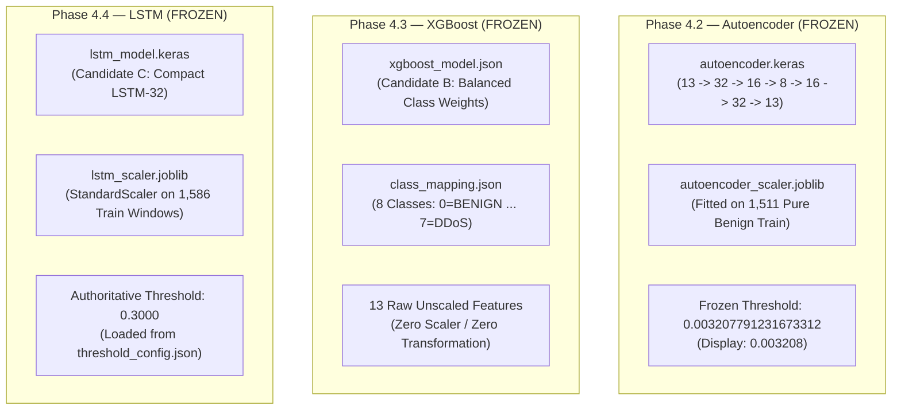
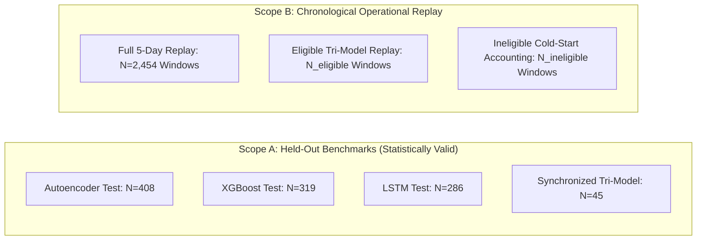
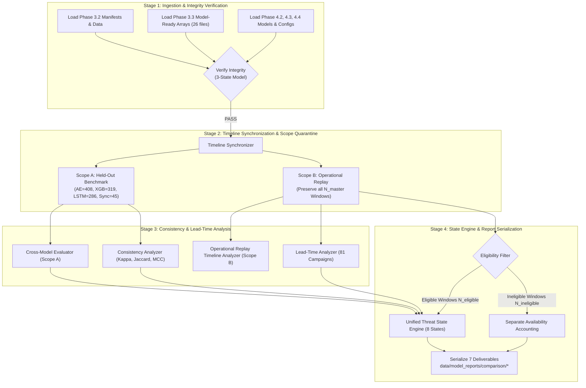

# NexThreat — Phase 4.5 Architecture Design Audit & Specification v2.9

**Project**: NexThreat ("Detect anomalies. Forecast attacks. Prevent damage.")  
**Phase**: Phase 4.5 — Cross-Model Evaluation, Consistency Audit, & Unified Threat Inference Architecture  
**Document Version**: 2.9 (Final Authoritative Specification — Decoupled Availability from Threat-State Eligibility & Scope-B Conservation Amendment)  
**Execution Mode**: DESIGN AUDIT & FORMAL SPECIFICATION ONLY — ZERO IMPLEMENTATION CODE  
**Authoritative Global Seed**: 42  

---

## 1. Executive Summary

NexThreat addresses the Smart India Hackathon (SIH) problem statement: **"AI-Based Network Attack Forecasting from Network Traffic Data."**  
Across Phases 4.1 through 4.4, NexThreat developed, evaluated, and independently verified three dedicated, specialized AI models:
- **Phase 4.2 — Autoencoder**: Current-window unsupervised anomaly detection (PASS / FROZEN).
- **Phase 4.3 — XGBoost**: Current-window 8-class supervised attack categorization (PASS / FROZEN).
- **Phase 4.4 — LSTM**: Forward-looking sequence-based attack forecasting targeting the subsequent window (PASS / FROZEN).

This document establishes **Version 2.9** of the Phase 4.5 Architecture Design Audit and Specification. Following an exhaustive, line-by-line inspection of the actual repository code and metadata across Phases 3.2 through 4.4 and formal specification-authority resolution of the four architectural blockers:
1. **Grounded Three-State Integrity Model**: Every frozen artifact possesses **exactly one primary integrity authority**.
2. **Authoritative Campaign Ground Truth**: Validates early-warning lead time across exactly **81 attack campaigns** physically materialized in Phase 3.1 (`attack_segments.csv`).
3. **Canonical 13-Feature Contract**: Consumes the exact 13 engineered features in fixed order (`flow_count` through `syn_packet_ratio`) with frozen, isolated scalers.
4. **Deterministic Null Handling**: Undefined metrics serialize as JSON `null` with explicit reasons (`"zero_positive_union"`, `"zero_marginal_variance"`).
5. **Decoupled Model-Output Availability & Threat-State Eligibility**: Reconciles the frozen 8-state binary taxonomy $\{0, 1\}^3$ with Scope-B operational replay by formally separating **model-output availability** from **threat-state eligibility**, enforcing the **Eligibility-Contiguity Rule**, and establishing dynamic sample conservation over eligible windows.

### The Three-State Integrity Model:

1. **State 1 — SHA-256 Authority Exists (`SHA256_AUTHORITY_ESTABLISHED`)**:
   - Where a concrete, pre-existing repository source contains an authoritative expected SHA-256 checksum for an artifact, expected-vs-actual SHA-256 verification is **mandatory**.
   - The runtime verifier dynamically calculates the actual SHA-256 of the artifact on disk in 64 KB chunks and compares it against the expected value dynamically retrieved from the authority source.
   - Hashes must never be hardcoded into Phase 4.5 source code. Any mismatch or cross-manifest conflict causes **immediate verification failure**.
   - *Formal Rule*: `SHA-256 authority exists → expected-vs-actual SHA-256 verification is mandatory.`

2. **State 2 — No SHA-256 Authority, Existing Non-SHA Integrity Mechanism Exists (`NON_SHA_INTEGRITY_MECHANISM_ESTABLISHED`)**:
   - Where no expected SHA-256 authority exists in the repository, but the repository contains an established structural, identity, byte-for-byte, or functional verification mechanism, Phase 4.5 uses that existing mechanism.
   - The specification explicitly documents: *"No SHA-256 authority is claimed for this artifact; Primary SHA-256 Authority: NOT ESTABLISHED IN EXISTING REPOSITORY."*
   - Phase 4.5 does **not** fabricate a checksum manifest or authority, and does **not** treat the absence of an expected SHA-256 hash as an automatic failure.
   - Verification passes if and only if the documented non-SHA mechanism passes; failure occurs only if the structural or identity invariants fail.
   - *Formal Rule*: `SHA-256 authority absent + existing non-SHA mechanism present → use existing mechanism without claiming SHA-256 authority.`

3. **State 3 — No Integrity Mechanism Exists (`NO_INTEGRITY_AUTHORITY_ESTABLISHED`)**:
   - Where neither a SHA-256 authority nor an established non-SHA integrity/identity mechanism exists, the artifact has no verifiable integrity foundation.
   - This state constitutes an unresolved evidence gap and results in **immediate failure / non-approval** (`FAIL / NOT APPROVED`).
   - *Formal Rule*: `No SHA-256 authority + no existing non-SHA mechanism → FAIL.`

---

### Four-Concept Separation Framework:

To eliminate all ambiguity, the specification enforces a strict separation across four operational concepts:
1. **Primary SHA-256 Authority/Source**: The single, concrete repository source containing the authoritative expected SHA-256 hash value.
2. **Verification Mechanism**: The concrete repository script or function that executes integrity validation or calculates runtime checksums.
3. **Verification Report**: The generated or existing report artifact documenting audit findings.
4. **Secondary Cross-Check**: Any duplicate reference, copy, or cross-phase check compared against the primary authority.

These four concepts are never conflated. A script is not an authority; a report is not an authority unless it establishes expected hashes; and a binary checkpoint is not an expected-hash authority.

---

### Key Grounded Integrity Findings in Version 2.9:
- **Phase 3.2 Split Manifests**: The repository does **NOT** contain precomputed SHA-256 hash manifests for `autoencoder_split_manifest.csv`, `xgboost_split_manifest.csv`, or `lstm_split_manifest.csv`. Their integrity is anchored by structural and partition invariants audited by `src/dataset_preparation/verify_dataset_splits.py` and recorded in `data/model_inputs/manifests/split_integrity_report.json` ($N=2,454$, zero duplicate indices, zero partition overlap). The primary SHA-256 authority for these manifest CSVs is classified as **`NOT ESTABLISHED IN EXISTING REPOSITORY`** under Integrity State 2 (`NON_SHA_INTEGRITY_MECHANISM_ESTABLISHED`).
- **Phase 3.2 Materialized Datasets**: The nine materialized input CSV datasets possess a genuine, concrete primary SHA-256 authority: `src.model_preparation.verify_model_ready_data.BASELINE_PHASE_3_2_HASHES` under Integrity State 1 (`SHA256_AUTHORITY_ESTABLISHED`).
- **Phase 3.3 Model-Ready Files**: Exactly 26 model-ready files exist on disk and in `src.models.verification.verify_model_infrastructure.BASELINE_MODEL_READY_HASHES`. These consist of exactly 17 numerical `.npy` arrays, 3 scalers/encoders (including `lstm_scaler.joblib`), and 6 metadata/report files under Integrity State 1 (`SHA256_AUTHORITY_ESTABLISHED`).
- **LSTM Scaler Authority Ownership**: The sole Primary SHA-256 Authority for `lstm_scaler.joblib` (both at `data/model_ready/artifacts/lstm_scaler.joblib` and its runtime copy at `data/models/lstm/lstm_scaler.joblib`) is Phase 3.3 `src.models.verification.verify_model_infrastructure.BASELINE_MODEL_READY_HASHES`. The entry in `data/model_reports/lstm/model_hashes.json` is strictly audited as a **secondary consistency cross-check** and is NOT a primary authority.
- **Phase 4.2 Autoencoder Model Artifacts**: The repository does **NOT** contain a static `model_hashes.json` or precomputed expected SHA-256 manifest for `final_model/autoencoder.keras`. Its primary SHA-256 authority is classified as **`NOT ESTABLISHED IN EXISTING REPOSITORY`** under Integrity State 2 (`NON_SHA_INTEGRITY_MECHANISM_ESTABLISHED`). Integrity is established via artifact reference verification (byte-for-byte identity against `checkpoints/best_model.keras`, both exactly 70,183 bytes) and functional verification (loadability and forward pass) by `src/models/autoencoder/verify_autoencoder.py`.
- **Phase 4.2 Autoencoder Metadata & Threshold**: Authoritative model configuration and decision threshold (`0.003207791231673312`) are established by `data/models/autoencoder/artifacts/model_metadata.json`, which is an authoritative metadata source under Integrity State 2, not a SHA-256 authority.
- **Phase 4.3 XGBoost Artifacts**: Authoritative expected hashes for 10 artifacts are stored in `data/models/xgboost/model_hashes.json` under Integrity State 1 (`SHA256_AUTHORITY_ESTABLISHED`).
- **Phase 4.4 LSTM Artifacts**: Authoritative expected hashes for the 12 model and evaluation artifacts are stored in `data/model_reports/lstm/model_hashes.json` under Integrity State 1 (`SHA256_AUTHORITY_ESTABLISHED`). The 13th entry in that report (`lstm_scaler.joblib`) is audited strictly as a secondary cross-check against its primary Phase 3.3 authority.

---

## 2. Phase 4.5 Objective

Phase 4.5 is **NOT** a fourth machine-learning model, meta-learner, neural fusion layer, or stacking ensemble.  
Phase 4.5 is a **deterministic post-model evaluation, consistency audit, temporal lead-time analysis, and unified inference specification** operating strictly on the outputs of the three frozen, pre-trained AI models.

### Primary Objectives:
1. **Multi-Model Timeline Synchronization**: Align Autoencoder, XGBoost, and LSTM inference representations across the 2,454 represented one-minute chronological windows in `global_position` order covering the Monday–Friday traffic dataset.
2. **Strict Held-Out Cross-Model Benchmarking (Scope A)**: Report individual test metrics alongside mutual held-out agreement metrics on out-of-sample data without data leakage.
3. **Chronological Operational Replay (Scope B)**: Simulate continuous real-time SOC traffic monitoring across Monday through Friday to analyze transition dynamics, alert persistence, and temporal patterns, explicitly decoupling model-output availability from threat-state eligibility.
4. **Pairwise and Tri-Model Consistency Audits**: Compute Cohen's Kappa, Jaccard similarity, Matthews Correlation Coefficient (MCC), and agreement rates across binary attack/non-attack representations with strict `null` guardrails for indeterminate divisions.
5. **Attack Forecasting Lead-Time Analysis**: Validate the early-warning horizon of LSTM forecasts relative to current-window attack onset across all 81 attack segments.
6. **Deterministic Tri-Model Threat State Engine**: Map the $2^3 = 8$ binary output permutations into neutral, explainable threat states with transparent investigation priorities for threat-state eligible windows.
7. **Deliverable Serialization & Independent Verification**: Generate exactly 7 standardized report artifacts (6 JSON + 1 Markdown) and verify the pipeline via a 19-point independent verification suite.

---

## 3. Frozen Prior-Phase Contracts

Phase 4.5 operates strictly downstream of the frozen Phases 1 through 4.4. All prior phases are immutable:



### Invariable Specifications:
1. **Phase 2.2**: 2,454 represented one-minute chronological traffic windows in `global_position` order across Monday through Friday.
2. **Phase 2.3**: Canonical 13 engineered numerical features in fixed order (`flow_count` to `syn_packet_ratio`).
3. **Phase 3.2**: Model-specific split manifests for Autoencoder, XGBoost, and LSTM verified by `src/dataset_preparation/verify_dataset_splits.py`.
4. **Phase 3.3**: Model-ready arrays, metadata, and scaler artifacts verified by `src/model_preparation/verify_model_ready_data.py`.
5. **Phase 4.1**: Centralized directory structure, read-only data isolation, and reproducibility seed (`42`) verified by `src/models/verification/verify_model_infrastructure.py`.
6. **Phase 4.2 (Autoencoder)**:
   - Architecture: 13 → 32 → 16 → 8 → 16 → 32 → 13.
   - Authoritative stored threshold: `0.003207791231673312` (dynamically loaded from `model_metadata.json` and `autoencoder_evaluation_report.json`).
   - Display/reference rounding: `0.003208` (prohibited from runtime decision comparators).
   - Decision comparator: Anomaly flagged if reconstruction $\text{MSE}_t \ge 0.003207791231673312$.
7. **Phase 4.3 (XGBoost)**:
   - Objective: `multi:softprob` across 8 classes (`0=BENIGN` ... `7=DDoS`).
   - Decision rule: $\hat{y}_t = \text{argmax}_{c \in [0, 7]} P(y_t = c)$. Binary attack: $\hat{y}_t \ne 0$.
8. **Phase 4.4 (LSTM)**:
   - Architecture: Input `(10, 13)` → LSTM(32) → Dropout → Dense(16, ReLU) → Dropout → Dense(1, Sigmoid).
   - Authoritative threshold: `0.3000` (dynamically loaded from `threshold_config.json`).
   - Decision rule: Forecast attack if $P(\text{attack}) \ge 0.3000$.

*Phase 4.5 consumes frozen model decisions and does not perform threshold optimization, calibration, or tuning.*

---

## 4. Data Scope Separation: Scope A vs Scope B

To maintain scientific rigor and prevent benchmark conflation, Phase 4.5 operates under two strictly quarantined scopes:



### 4.1 Scope A: Held-Out Model Benchmarking
- **Definition**: Strictly out-of-sample held-out test windows from Phase 3.2 splits.
- **Purpose**: Measure true statistical generalization and benchmark model fidelity.
- **Populations**:
  - Individual Autoencoder Benchmark: $N = 408$
  - Individual XGBoost Benchmark: $N = 319$
  - Individual LSTM Benchmark: $N = 286$
  - Mutual Partition-Level Overlap: $N = 51$
  - Valid Synchronized Tri-Model Concordance Subset: $N = 45$ (excluding invalid lookback boundaries)
- **Constraint**: Individual benchmarks remain primary; the $N=45$ subset is used strictly for cross-model concordance and does not replace individual benchmarks.

### 4.2 Scope B: Full-Timeline Operational Replay
- **Definition**: Continuous chronological replay across all 2,454 represented one-minute windows in `global_position` order covering the Monday–Friday active dataset periods.
- **Purpose**: Simulate real-time SOC operations, temporal alert persistence, transition dynamics, and attack lead-time distribution.
- **Decoupled Architecture**: Preserves every window in operational replay, separating infrastructure model availability from threat-state eligibility.
- **Strict Guardrail**: Scope B contains training and validation windows. **Scope B must NEVER be used for model evaluation benchmarking, model comparison claims, threshold tuning, or hyperparameter selection.**

---

## 5. Temporal Alignment Contract

Temporal alignment across the three models is strictly defined as:

$$\mathbf{\text{Alignment}(t) = \text{AE}(t) + \text{XGB}(t) + \text{LSTM}(t-1 \to t)}$$

Where:
- $\text{AE}(t)$: Autoencoder reconstruction anomaly flag for current window $t$.
- $\text{XGB}(t)$: XGBoost 8-class prediction for current window $t$ (binary: class $\ne 0$).
- $\text{LSTM}(t-1 \to t)$: LSTM forward-looking attack forecast generated at window $t-1$ targeting window $t$.

```text
Window Index:       t-1                 t                 t+1
                     |                  |                  |
Autoencoder:         |              [ AE(t) ]              |      (Current Anomaly)
XGBoost:             |              [ XGB(t) ]             |      (Current Classification)
LSTM Forecast:  [ LSTM(t-1) ] ─────────► targets t         |      (Targeted Forecast)
                     |                  |                  |
Unified Inference:   |         [ State Engine @ t ]        |      (Synchronized Alignment)
```

**Temporal Invariant**: Window $t$ unified inference evaluates what LSTM *forecasted* for $t$ using data up to $t-1$, alongside what AE and XGB *detect* at $t$.

---

## 6. Synchronized Evaluation Population ($N=51$ vs $N=45$)

A critical technical invariant in Phase 4.5 is the exact distinction between partition overlap and valid sequence inference:

```text
Partition Overlap (Manifest Level):
Autoencoder Test ∩ XGBoost Test ∩ LSTM Test = 51 Windows

Excluded Positions (Lookback / Boundary Invalidation):
{918, 2383, 2384, 2385, 2386, 2387} (6 Windows)

Valid Synchronized Tri-Model Inference Subset (Scope A):
51 - 6 = 45 Windows
```

### Exclusion Rationales:
1. **Window 918 (Wednesday Cold Start)**: Window 918 is the 10th window of Wednesday (indices 909–918). Under Phase 3.3 sequence generation rules, sequence formation requires lookback strictly within the active day partition. Window 918 represents the sequence formation boundary where target-aligned sequence forecasting begins, lacking a preceding target-aligned prediction from index 917 within the held-out test partition.
2. **Windows 2383–2387 (Friday Campaign Boundary)**: Friday test split sequence formation encounters boundary padding and sequence cutoffs at the end of the Friday test partition, preventing valid $(10, 13)$ lookback without sequence leakage across partition splits.

*The N=45 subset represents the exact, mathematically valid intersection where all three models have valid, non-leaking test predictions.*

---

## 7. Pairwise Consistency Metrics

Pairwise consistency between models across binary representations is evaluated using:

1. **Cohen's Kappa ($\kappa$)**:
   $$\kappa = \frac{P_o - P_e}{1 - P_e}$$
   Where $P_o$ is observed agreement and $P_e$ is chance agreement.
2. **Jaccard Similarity Index ($J$)**:
   $$J(A, B) = \frac{|A \cap B|}{|A \cup B|} = \frac{\text{TP}}{\text{TP} + \text{FP} + \text{FN}}$$
   *Mathematical Guardrail*: When $\text{TP} + \text{FP} + \text{FN} = 0$ (zero positive union), Jaccard similarity is mathematically undefined ($0/0$). In this scenario, Jaccard must return JSON `null` with `"jaccard_undefined_reason": "zero_positive_union"`. Substituting `0.0`, `1.0`, or any numeric value is strictly prohibited.
3. **Matthews Correlation Coefficient (MCC)**:
   $$\text{MCC} = \frac{\text{TP} \times \text{TN} - \text{FP} \times \text{FN}}{\sqrt{(\text{TP}+\text{FP})(\text{TP}+\text{FN})(\text{TN}+\text{FP})(\text{TN}+\text{FN})}}$$
   *Mathematical Guardrail*: If any sum in the denominator is zero (zero marginal variance), MCC is mathematically undefined. In this scenario, MCC must return `null` with reason `"zero_marginal_variance"`. It must **never** be replaced with a fake `0.0`.
4. **Raw Agreement / Disagreement Rates**:
   $$\text{Agreement} = \frac{\text{Concordant Windows}}{N}, \quad \text{Disagreement} = 1.0 - \text{Agreement}$$

---

## 8. Tri-Model Concordance Analysis & Conservation Laws

Concordance evaluates the simultaneous agreement of all three models across the 8 possible binary states:

$$\mathbf{S} = \{0, 1\}^3 \implies 2^3 = 8 \text{ Permutations}$$

### Permutation Space:
1. $(0, 0, 0)$: Complete Benign Concordance (All models agree: Benign)
2. $(0, 0, 1)$: Forecast Anomaly (LSTM only)
3. $(0, 1, 0)$: Isolated Signature (XGBoost only)
4. $(0, 1, 1)$: Forecast & Classification Alignment (XGBoost + LSTM)
5. $(1, 0, 0)$: Unsupervised Anomaly (Autoencoder only)
6. $(1, 0, 1)$: Anomaly & Forecast Alignment (Autoencoder + LSTM)
7. $(1, 1, 0)$: Current Attack Consensus (Autoencoder + XGBoost)
8. $(1, 1, 1)$: Full Tri-Model Consensus (All models agree: Attack)

### Authoritative Conservation Laws (v2.9 Amendment):
1. **Scope A Held-Out Conservation**:
   All 45 synchronized test windows possess complete tri-model binary decisions:
   $$\sum_{i=0}^7 \text{Count}(S_i) \equiv N_{\text{scope\_A}} = 45$$
2. **Scope B Operational Replay Conservation**:
   State categorization is mathematically defined **only** over threat-state eligible windows possessing complete tri-model binary evidence ($N_{\text{eligible}}$):
   $$\sum_{i=0}^7 \text{Count}(S_i) \equiv N_{\text{eligible}}$$
3. **Master-Timeline Partition Conservation**:
   Every represented window in the master timeline ($N_{\text{master}}$) is preserved and accounted for across eligibility partitions:
   $$N_{\text{master}} \equiv N_{\text{eligible}} + N_{\text{ineligible}}$$
   Therefore:
   $$\sum_{i=0}^7 \text{Count}(S_i) + N_{\text{ineligible}} \equiv N_{\text{master}}$$

*Dynamic Derivation Rule*: $N_{\text{master}}$, $N_{\text{eligible}}$, and $N_{\text{ineligible}}$ must be dynamically computed by runtime synchronization. For the current repository, independent verification confirms expected values: $N_{\text{master}} = 2,454$, $N_{\text{eligible}} = 2,404$, $N_{\text{ineligible}} = 50$ (derived from 5 days $\times$ 10 lookback cold-start windows). These historical numbers serve as verification expectations and MUST NOT be hardcoded as runtime authority.

---

## 9. Attack Forecasting Lead-Time Analysis

Lead-time analysis measures the operational early-warning horizon provided by LSTM forecasts prior to attack onset:

### Evaluation Rules:
1. **81 Attack Campaigns**: Analysis is conducted across all 81 attack campaign segments physically materialized in Phase 3.1 (`attack_segments.csv`).
2. **Campaign Onset ($T_{\text{onset}}$)**: The first window $t$ of an attack segment where ground truth $y_t \ne 0$ from `attack_segments.csv`.
3. **Deterministic Lead Time Formulation**:
   $$\Delta t_{\text{lead}} = T_{\text{onset}} - T_{\text{first\_forecast}}$$
   Where $T_{\text{first\_forecast}}$ is the window index at which the earliest forecast was generated in a contiguous, unbroken sequence of positive LSTM attack forecasts ($\hat{y}_{\text{lstm}} = 1$) leading directly into $T_{\text{onset}}$ without intervening benign forecasts ($\hat{y}_{\text{lstm}} = 0$) or lookback unavailability:
   - The single-step forecast directly targeting $T_{\text{onset}}$ is formulated at window $T_{\text{onset}} - 1$ ($\text{LSTM}(T_{\text{onset}} - 1 \to T_{\text{onset}})$). If positive, an early warning is established.
   - The sequence is traced backward through preceding consecutive single-step forecasts ($\text{LSTM}(t - 1 \to t) = 1$); $T_{\text{first\_forecast}}$ is the generation window ($t - 1$) of the earliest positive forecast in this continuous alert run, yielding $\Delta t_{\text{lead}} = T_{\text{onset}} - T_{\text{first\_forecast}} \ge 1$ windows.
   - If the forecast at $T_{\text{onset}} - 1$ targeting $T_{\text{onset}}$ is benign ($0$), the campaign is unwarned ($\Delta t_{\text{lead}} = 0$).
4. **Strict Boundary Rules**:
   - Day boundaries must **never** be crossed.
   - Lookback sequences crossing partition splits or day boundaries are marked `"unavailable"`.
   - If an attack begins within the first 10 windows of a day, preceding forecasts are structurally unavailable.
5. **Campaigns Beginning During Unavailable Intervals**:
   If an attack campaign begins during an interval where preceding lookback is structurally unavailable, the pipeline must NOT fabricate a forecast, must NOT coerce `"unavailable"` to 0 or 1, and must NOT assign an 8-state threat state based on incomplete evidence. Lead time MUST be explicitly serialized as `"unavailable"`. It must **never** be encoded as `0` (which signifies concurrent detection without early warning).

---

## 10. Unified Inference Engine & Eligibility Decoupling

The Unified Inference Engine maps each window's tri-model output vector into exactly one of **8 Canonical Neutral States**:

| State Code | Canonical State Name | Autoencoder (t) | XGBoost (t) | LSTM (t-1→t) | Investigation Priority | Operational Meaning |
|---|---|:---:|:---:|:---:|---|---|
| **S0** | `BENIGN_CONCORDANCE` | 0 | 0 | 0 | Priority 4 (Routine) | Normal baseline; all models concordant benign. |
| **S1** | `LSTM_FORECAST_ONLY` | 0 | 0 | 1 | Priority 3 (Early Warning) | Forward-looking warning; current window benign. |
| **S2** | `XGB_ATTACK_ONLY` | 0 | 1 | 0 | Priority 3 (Isolated Signature) | Known signature matched without AE anomaly. |
| **S3** | `XGB_LSTM_CONSISTENCY` | 0 | 1 | 1 | Priority 2 (Elevated Investigation) | Forecasted signature attack active; low AE error. |
| **S4** | `AE_ANOMALY_ONLY` | 1 | 0 | 0 | Priority 3 (Unclassified Anomaly) | Statistical deviation without signature match. |
| **S5** | `AE_LSTM_CONSISTENCY` | 1 | 0 | 1 | Priority 2 (Elevated Investigation) | Forecasted novel anomaly active. |
| **S6** | `AE_XGB_CONSENSUS` | 1 | 1 | 0 | Priority 2 (Elevated Investigation) | Unpredicted sudden attack confirmed by AE + XGB. |
| **S7** | `TRI_MODEL_CONSENSUS` | 1 | 1 | 1 | Priority 1 (High-Confidence Incident) | Full agreement: forecasted, anomalous, classified. |

### Decoupling Rules & Strict Protections:
1. **Separation of Availability from Eligibility**:
   - Model-output availability describes whether a given AI model produced a valid output for window $t$.
   - Threat-state eligibility describes whether a window possesses the complete tri-model binary vector required to evaluate the mapping $\mathcal{T}: \{0, 1\}^3 \to \{S_0 \dots S_7\}$.
2. **Ineligible Window Handling**:
   - A window is eligible **if and only if** $b_{\text{ae}}, b_{\text{xgb}}, b_{\text{lstm}} \in \{0, 1\}$.
   - If any model's output is `"unavailable"` (such as LSTM lookback cold starts), the window is ineligible:
     ```json
     {
       "is_eligible_for_threat_state": false,
       "threat_state": null,
       "ineligibility_reason": "lstm_lookback_unavailable"
     }
     ```
3. **Strict Taxonomical Preservation**:
   - Exactly eight canonical states ($S_0 \dots S_7$) exist.
   - Introducing a 9th state ($S_8$ or `LSTM_UNAVAILABLE` as a threat state) is **STRICTLY PROHIBITED**.
   - Converting `"unavailable"` to `0` or `1`, fabricating predictions, or dropping windows from the operational timeline is **STRICTLY PROHIBITED**.
4. **Eligibility-Contiguity Rule for Transitions and Dwell Times**:
   - State transitions and dwell times are calculated strictly across contiguous sequences of eligible windows.
   - An ineligible window terminates the current dwell run and breaks transition contiguity.
   - No state transition $P(S_j \mid S_i)$ or dwell-time sequence may bridge across an ineligible window.

---

## 11. Priority-Ranked Alert Formulation

To prevent alert fatigue while ensuring critical threats receive immediate attention, inference states are grouped into four operational triage tiers:

1. **Priority 1 (Immediate SOC Triage)**:
   - State: `TRI_MODEL_CONSENSUS` (`S7`).
   - Action: Highest-priority operational ticket. Complete tri-model consensus confirming attack presence.
2. **Priority 2 (Priority Investigation)**:
   - States: `AE_XGB_CONSENSUS` (`S6`), `XGB_LSTM_CONSISTENCY` (`S3`), `AE_LSTM_CONSISTENCY` (`S5`).
   - Action: Multi-model evidence verified. Two independent AI paradigms confirm malicious or anomalous activity.
3. **Priority 3 (Monitored Anomalies & Warnings)**:
   - States: `LSTM_FORECAST_ONLY` (`S1`), `XGB_ATTACK_ONLY` (`S2`), `AE_ANOMALY_ONLY` (`S4`).
   - Action: Single-model alert. System logs event, monitors subsequent windows, and prepares lookback context.
4. **Priority 4 (Baseline Operations)**:
   - State: `BENIGN_CONCORDANCE` (`S0`).
   - Action: Routine traffic logging; no analyst action required.

---

## 12. Architectural Constraints & Hard Prohibitions

To preserve the scientific integrity of NexThreat, Phase 4.5 enforces strict architectural boundaries:

1. **No Fourth Model**: Phase 4.5 is strictly an inference and evaluation layer. No meta-learners, neural networks, or stacking classifiers may be introduced.
2. **No Weighted Numerical Threat Scoring**: No formulas blending probabilities into arbitrary scalar scores (e.g., $S_t = 0.45 P_{\text{xgb}} + 0.30 \text{MSE} + 0.25 P_{\text{lstm}}$). Threat assessment is strictly state-based.
3. **No Composite Probabilities**: Uncalibrated numbers must never be presented as joint probabilities.
4. **No Autonomous Network Remediation**: Phase 4.5 informs human SOC analysts via investigation priorities. It must **never** execute autonomous firewall blocking, traffic redirection, or service termination.
5. **No Model-Output Coupling**: The three AI models remain strictly independent. Model outputs must never be fed as input features into other models.
6. **No Legacy Semantic Labels**: Labels such as "CRITICAL_ATTACK", "PROBABLE_ATTACK", or "SUSPICIOUS_ACTIVITY" are strictly prohibited in favor of the 8 canonical neutral states.

---

## 13. Pipeline Execution Flow

Phase 4.5 executes as a clean, modular 4-stage pipeline:



---

## 14. Artifact & Input Contracts

Each Phase 4.5 input artifact has an explicitly classified integrity authority. Where an established SHA-256 authority exists, SHA-256 is verified dynamically against the authoritative expected value. Where no SHA-256 authority exists but an established non-SHA structural, identity, byte-for-byte, or functional verification mechanism exists, that mechanism is used without claiming SHA-256 authority. Where neither exists, the artifact fails the integrity-authority requirement.

### 14.1 Phase 3.2 Manifests & Metadata
- `data/model_inputs/manifests/autoencoder_split_manifest.csv`
- `data/model_inputs/manifests/xgboost_split_manifest.csv`
- `data/model_inputs/manifests/lstm_split_manifest.csv`
- `data/model_inputs/manifests/split_integrity_report.json`
- `data/model_inputs/metadata/attack_segments.csv` (authoritative for 81 attack campaigns)

### 14.2 Phase 3.3 Model-Ready Datasets (Explicit Enumeration of all 26 Files)
All 26 model-ready files in `data/model_ready/` are enumerated and verified against `BASELINE_MODEL_READY_HASHES` from `src.models.verification.verify_model_infrastructure`:
1. **Numerical Arrays (Exactly 17 numerical `.npy` arrays)**:
   - Autoencoder (5 arrays): `autoencoder/X_train.npy`, `X_validation.npy`, `X_test.npy`, `y_validation.npy`, `y_test.npy`.
   - XGBoost (6 arrays): `xgboost/X_train.npy`, `X_validation.npy`, `X_test.npy`, `y_train.npy`, `y_validation.npy`, `y_test.npy`.
   - LSTM (6 arrays): `lstm/X_train.npy`, `X_validation.npy`, `X_test.npy`, `y_train.npy`, `y_validation.npy`, `y_test.npy`.
2. **Preprocessing Scalers & Encoders (Exactly 3 artifacts)**:
   - `artifacts/autoencoder_scaler.joblib` (StandardScaler on 13 features)
   - `artifacts/lstm_scaler.joblib` (RobustScaler on 13 features)
   - `artifacts/xgboost_label_encoder.joblib` (LabelEncoder for 8 classes)
3. **Metadata & Audit Reports (Exactly 6 artifacts)**:
   - `metadata/feature_columns.json` (canonical 13 features)
   - `metadata/preparation_metadata.json`
   - `metadata/xgboost_label_mapping.json`
   - `metadata/lstm_sequence_metadata.json`
   - `metadata/lstm_sequence_provenance.csv`
   - `reports/model_preparation_report.json`

---

## 15. Output Deliverables & Schemas

Phase 4.5 produces **exactly 7 deliverables (6 JSON + 1 Markdown)** in `data/model_reports/comparison/`:

```text
data/model_reports/comparison/
├── cross_model_evaluation_report.json
├── model_consistency_report.json
├── tri_model_threat_matrix.json
├── temporal_lead_time_report.json
├── unified_inference_spec.json
├── phase_4_5_verification_report.json
└── phase_4_5_summary.md
```

### Authoritative Deliverable JSON Schemas:

#### 1. `cross_model_evaluation_report.json`:
```json
{
  "phase": "4.5",
  "report_name": "Cross-Model Evaluation & Benchmark Report",
  "timestamp": null,
  "scope_a_individual_benchmarks": {
    "autoencoder": {
      "sample_count": 408,
      "reconstruction_error_mean": null,
      "reconstruction_error_std": null,
      "threshold": 0.003207791231673312,
      "anomalies_detected": null,
      "anomaly_rate": null
    },
    "xgboost": {
      "sample_count": 319,
      "macro_f1": null,
      "weighted_f1": null,
      "accuracy": null,
      "attacks_detected": null,
      "attack_rate": null
    },
    "lstm": {
      "sample_count": 286,
      "precision": null,
      "recall": null,
      "f1_score": null,
      "auc_pr": null,
      "threshold": 0.3000,
      "forecasts_positive": null
    }
  },
  "scope_a_synchronized_benchmark": {
    "sample_count": 45,
    "mutual_overlap_positions": 51,
    "excluded_positions": [918, 2383, 2384, 2385, 2386, 2387],
    "pairwise_metrics": null
  },
  "scope_b_operational_replay": {
    "sample_count": 2454,
    "autoencoder_positive_rate": null,
    "xgboost_positive_rate": null,
    "lstm_positive_rate": null,
    "lstm_unavailable_count": null
  }
}
```

#### 2. `model_consistency_report.json`:
```json
{
  "phase": "4.5",
  "report_name": "Pairwise Model Consistency & Concordance Report",
  "timestamp": null,
  "scope_a_pairwise_consistency": {
    "sample_count": 45,
    "ae_vs_xgboost": {
      "cohens_kappa": null,
      "jaccard_similarity": null,
      "jaccard_undefined_reason": null,
      "matthews_corrcoef": null,
      "mcc_undefined_reason": null,
      "raw_agreement_rate": null,
      "raw_disagreement_rate": null,
      "confusion_matrix": null
    },
    "xgboost_vs_lstm": {
      "cohens_kappa": null,
      "jaccard_similarity": null,
      "jaccard_undefined_reason": null,
      "matthews_corrcoef": null,
      "mcc_undefined_reason": null,
      "raw_agreement_rate": null,
      "raw_disagreement_rate": null,
      "confusion_matrix": null
    },
    "ae_vs_lstm": {
      "cohens_kappa": null,
      "jaccard_similarity": null,
      "jaccard_undefined_reason": null,
      "matthews_corrcoef": null,
      "mcc_undefined_reason": null,
      "raw_agreement_rate": null,
      "raw_disagreement_rate": null,
      "confusion_matrix": null
    }
  },
  "scope_b_pairwise_consistency": {
    "sample_count": 2454,
    "ae_vs_xgboost": {
      "cohens_kappa": null,
      "jaccard_similarity": null,
      "jaccard_undefined_reason": null,
      "matthews_corrcoef": null,
      "mcc_undefined_reason": null,
      "raw_agreement_rate": null,
      "raw_disagreement_rate": null,
      "confusion_matrix": null
    },
    "xgboost_vs_lstm": {
      "cohens_kappa": null,
      "jaccard_similarity": null,
      "jaccard_undefined_reason": null,
      "matthews_corrcoef": null,
      "mcc_undefined_reason": null,
      "raw_agreement_rate": null,
      "raw_disagreement_rate": null,
      "confusion_matrix": null
    },
    "ae_vs_lstm": {
      "cohens_kappa": null,
      "jaccard_similarity": null,
      "jaccard_undefined_reason": null,
      "matthews_corrcoef": null,
      "mcc_undefined_reason": null,
      "raw_agreement_rate": null,
      "raw_disagreement_rate": null,
      "confusion_matrix": null
    }
  }
}
```

#### 3. `tri_model_threat_matrix.json`:
```json
{
  "phase": "4.5",
  "report_name": "Tri-Model Threat Inference Matrix Report",
  "timestamp": null,
  "scope_a_synchronized_test_intersection": {
    "sample_count": 45,
    "state_distribution": {
      "BENIGN_CONCORDANCE": null,
      "LSTM_FORECAST_ONLY": null,
      "XGB_ATTACK_ONLY": null,
      "XGB_LSTM_CONSISTENCY": null,
      "AE_ANOMALY_ONLY": null,
      "AE_LSTM_CONSISTENCY": null,
      "AE_XGB_CONSENSUS": null,
      "TRI_MODEL_CONSENSUS": null
    },
    "conservation_verified": null
  },
  "scope_b_operational_replay": {
    "total_master_timeline_windows": null,
    "eligible_windows_count": null,
    "ineligible_windows_count": null,
    "ineligibility_breakdown": {
      "lstm_lookback_cold_start": null
    },
    "state_distribution": {
      "BENIGN_CONCORDANCE": null,
      "LSTM_FORECAST_ONLY": null,
      "XGB_ATTACK_ONLY": null,
      "XGB_LSTM_CONSISTENCY": null,
      "AE_ANOMALY_ONLY": null,
      "AE_LSTM_CONSISTENCY": null,
      "AE_XGB_CONSENSUS": null,
      "TRI_MODEL_CONSENSUS": null
    },
    "conservation_verified": null
  },
  "state_transition_matrix": null,
  "dwell_time_statistics": null
}
```

*(Note: In `scope_b_operational_replay`, `total_master_timeline_windows`, `eligible_windows_count`, and `ineligible_windows_count` are dynamically derived at runtime. Independent verification confirms expected repository counts: $2,454 = 2,404 + 50$).*

#### 4. `temporal_lead_time_report.json`:
```json
{
  "phase": "4.5",
  "report_name": "Temporal Lead-Time & Attack Forecasting Report",
  "timestamp": null,
  "total_campaigns_analyzed": 81,
  "lead_time_summary": {
    "pre_warned_campaigns_count": null,
    "pre_warned_percentage": null,
    "lead_time_distribution": {
      "1_min": null,
      "2_5_min": null,
      "6_10_min": null,
      "unavailable_or_unpredicted": null
    }
  },
  "campaign_details": null
}
```

#### 5. `unified_inference_spec.json`:
```json
{
  "phase": "4.5",
  "specification_name": "Deterministic Tri-Model Inference Specification",
  "temporal_alignment": "AE(t), XGB(t), LSTM(t-1 -> t)",
  "canonical_states": [
    { "code": "S0", "name": "BENIGN_CONCORDANCE", "priority": "PRIORITY_4", "inputs": [0, 0, 0] },
    { "code": "S1", "name": "LSTM_FORECAST_ONLY", "priority": "PRIORITY_3", "inputs": [0, 0, 1] },
    { "code": "S2", "name": "XGB_ATTACK_ONLY", "priority": "PRIORITY_3", "inputs": [0, 1, 0] },
    { "code": "S3", "name": "XGB_LSTM_CONSISTENCY", "priority": "PRIORITY_2", "inputs": [0, 1, 1] },
    { "code": "S4", "name": "AE_ANOMALY_ONLY", "priority": "PRIORITY_3", "inputs": [1, 0, 0] },
    { "code": "S5", "name": "AE_LSTM_CONSISTENCY", "priority": "PRIORITY_2", "inputs": [1, 0, 1] },
    { "code": "S6", "name": "AE_XGB_CONSENSUS", "priority": "PRIORITY_2", "inputs": [1, 1, 0] },
    { "code": "S7", "name": "TRI_MODEL_CONSENSUS", "priority": "PRIORITY_1", "inputs": [1, 1, 1] }
  ]
}
```

#### 6. `phase_4_5_verification_report.json`:
```json
{
  "phase": "4.5",
  "verification_suite": "Independent Verification Suite v2.9",
  "overall_status": null,
  "checks": {
    "Check_A": null, "Check_B": null, "Check_C": null, "Check_D": null,
    "Check_E": null, "Check_F": null, "Check_G": null, "Check_H": null,
    "Check_I": null, "Check_J": null, "Check_K": null, "Check_L": null,
    "Check_M": null, "Check_N": null, "Check_O": null, "Check_P": null,
    "Check_Q": null, "Check_R": null, "Check_S": null
  }
}
```

---

## 16. Verification Architecture (Checks A–S)

The independent verifier (`src/models/verification/verify_phase_4_5.py`) executes 19 checks with objective PASS/FAIL criteria:

| Check ID | Check Name | Objective Pass Criteria |
|---|---|---|
| **Check A** | Frozen Artifact Existence | All required Phase 3.2, 3.3, 4.2, 4.3, and 4.4 input artifacts exist on disk. |
| **Check B** | SHA-256 Integrity & Authority Hierarchy | PASS condition: Every frozen artifact has an explicitly classified integrity state evaluated under the three-state rule with single primary authority per SHA artifact. |
| **Check C** | Phase 3.3 Immutability | No Phase 3.3 model-ready source array or artifact has been modified. |
| **Check D** | Feature Contract | All models consume exactly the canonical 13 features in fixed order. |
| **Check E** | Model Independence | Zero cross-model feature/output feeding; AST inspection confirms decoupled execution. |
| **Check F** | Threshold Authority | Thresholds consumed dynamically from frozen artifacts: Autoencoder stored value (`0.003207791231673312`), LSTM (`0.3000`). |
| **Check G** | LSTM Alignment | Temporal alignment verified: $\text{AE}(t)$, $\text{XGB}(t)$, $\text{LSTM}(t-1 \to t)$. |
| **Check H** | Partition Overlap | Manifest-level intersection verified as exactly $N = 51$ windows. |
| **Check I** | Synchronized Overlap | Valid target-synchronized tri-model prediction subset verified as exactly $N = 45$ windows under Scope-A Validity Contract. |
| **Check J** | State Taxonomy & Neutrality (No Falsification) | Exactly 8 canonical neutral states (`S0`–`S7`) exist; zero legacy semantic labels; zero ninth state; incomplete tuples receive no threat state (`threat_state: null`); `"unavailable"` is never coerced to binary `0` or `1`. |
| **Check K** | Scope-B Conservation | Scope-B operational replay satisfies exact sample conservation over complete tri-model eligible windows: $\sum_{i=0}^7 \text{Count}(S_i) \equiv N_{\text{eligible}}$, and master-timeline accounting satisfies: $N_{\text{eligible}} + N_{\text{ineligible}} \equiv N_{\text{master}}$ (expected repository verification counts: $2,404 + 50 = 2,454$). All sample counts are dynamically derived at runtime. |
| **Check L** | No Numerical Fusion | Code inspection confirms zero combined scoring or linear coefficient blending calculations exist in code. |
| **Check M** | No Autonomous Remediation | No autonomous remediation, actuation, firewall manipulation, packet-control command, or network-blocking logic is present in Phase 4.5 modules or invoked by Phase 4.5. |
| **Check N** | Metric Schema Completeness | All mandatory metric fields and applicable null-reason fields present in `model_consistency_report.json` schema. |
| **Check O** | Null Handling | Uncomputed metrics in design schemas serialize as JSON `null` with explicit reason metadata (`"zero_positive_union"`, `"zero_marginal_variance"`), never fake zero values. |
| **Check P** | Scope Separation | Scope A held-out benchmark and Scope B operational replay are strictly quarantined. |
| **Check Q** | Lead-Time Validity | Sequence boundaries and day boundaries enforced; unavailable forecasts marked `"unavailable"`; exactly 81 attack campaigns analyzed. |
| **Check R** | Deliverable Completeness | Exactly 7 deliverables (6 JSON + 1 Markdown) exist in `data/model_reports/comparison/`. |
| **Check S** | Specification Self-Consistency | PASS condition: Zero internal contradictions; complete artifact inventory; grounded Three-State Integrity Model enforced; canonical 13 features confirmed; 81 campaigns confirmed; decoupled availability and eligibility conservation verified. |

---

## 17. Hard Failure Conditions

Phase 4.5 execution will **FAIL IMMEDIATELY** if any of the following occur:
1. For any artifact with an established SHA-256 authority, an expected-vs-actual SHA-256 mismatch occurs, or its expected hash entry is missing.
2. For an artifact without an established SHA-256 authority, failure is determined by the documented existing non-SHA integrity/identity mechanism (e.g., byte-for-byte identity discrepancy or structural invariant violation).
3. Any required artifact has neither an established SHA-256 authority nor an established non-SHA integrity mechanism (`NO_INTEGRITY_AUTHORITY_ESTABLISHED`).
4. Any prior phase scaler (`autoencoder_scaler.joblib`, `lstm_scaler.joblib`) is refitted or modified.
5. Any frozen decision threshold (`0.003207791231673312`, `0.3000`) is altered or overridden.
6. Any fourth machine-learning model, meta-learner, or neural fusion layer is trained or instantiated.
7. Model outputs are coupled or fed as features into other models.
8. Combined numerical scoring or linear coefficient blending formulas are implemented.
9. Uncalibrated numbers are presented as composite probabilistic scores.
10. Held-out test metrics and operational replay metrics are combined or conflated.
11. Individual model test benchmarks ($N=408, 319, 286$) are replaced by the mutual intersection ($N=45$).
12. Temporal leakage occurs (using $\text{LSTM}_{t \to t+1}$ instead of $\text{LSTM}_{t-1 \to t}$ for window $t$).
13. The 8-state distribution fails to sum to $N_{\text{eligible}}$, incomplete tuples are assigned to $S_0 \dots S_7$, `"unavailable"` is coerced to a binary value, or state transitions bridge across unavailable intervals.
14. Sequences cross partition or day boundaries in violation of Phase 3.3 policies.
15. Unsupported security claims (e.g., "confirmed attack", "automated isolation") are presented as factual conclusions.
16. Cross-manifest checksum conflicts occur where two verification sources disagree on an artifact hash.
17. Any competing Phase 4.5 checksum authority is created or checksum constants are hardcoded into code.
18. A verification report or binary checkpoint is mislabeled as an expected-hash authority, a fake checksum authority is fabricated where none exists in the repository, or absence of a checksum authority is falsely treated as an automatic failure instead of invoking the documented structural/identity mechanism.
19. Any of the 19 independent verification checks (Checks A–S) fails.

---

## 18. Implementation Sequence

When approved, Phase 4.5 implementation will proceed in four discrete, sequential steps:

1. **Step 1: Configuration & Timeline Synchronization**:
   - Implement `src/models/comparison/config.py` with paths, thresholds, and canonical taxonomy.
   - Implement `src/models/comparison/timeline_synchronizer.py` to construct the 2,454-window aligned timeline, isolating Scope A ($N=45$) and identifying Scope B availability/eligibility partitions.
2. **Step 2: Cross-Model Evaluation & Consistency Analysis**:
   - Implement `src/models/comparison/cross_model_evaluator.py` (Scope A and Scope B metrics).
   - Implement `src/models/comparison/consistency_analyzer.py` (Kappa, Jaccard, MCC, 8-state matrix).
   - Implement `src/models/comparison/lead_time_analyzer.py` (81-campaign lead-time evaluation).
3. **Step 3: Threat Inference Engine & Report Serialization**:
   - Implement `src/models/comparison/threat_inference_engine.py` (Deterministic state engine enforcing Eligibility-Contiguity Rule).
   - Implement `src/models/comparison/report_generator.py` (Generate all 7 deliverables).
4. **Step 4: Independent Verification Suite**:
   - Implement and execute `src/models/verification/verify_phase_4_5.py` (Checks A through S).
   - Achieve: `PHASE 4.5 STATUS: PASS`.

---

## 19. Risks and Limitations

1. **Small Mutual Test Intersection ($N=45$)**: Because each model was trained under distinct data constraints, only 45 windows are simultaneously held-out test samples across all three models. While scientifically necessary for pure cross-model benchmarking, statistical confidence intervals on this subset are wider than on the individual test sets.
2. **Class Imbalance in Test Windows**: Rare attack classes (such as Web Attack, with 0 validation and 3 test windows) have limited representation in the held-out test splits.
3. **Lookback Cold-Start as Model Availability**: At the beginning of each day (first 10 windows), LSTM forecasts are unavailable due to strict day boundary enforcement. In Version 2.9, this is strictly treated as a model-output availability condition, decoupled from the 8-state threat taxonomy via separate eligibility accounting.
4. **Differences in Model Specificity**: Autoencoder and LSTM individually exhibit higher false positive rates on benign traffic than XGBoost. The deterministic multi-model consensus state (`TRI_MODEL_CONSENSUS`) effectively provides multi-model evidence for analyst triage.

---

## 20. Specification Change Log

| Item | Area of Specification | Description of Change in Specification |
|:---:|---|---|
| **1** | Broad "Hash-Authoritative" Language | Purged all broad assertions stating that "all input artifacts are manifest- and hash-authoritative." Replaced with explicit classification across the three-state integrity model. |
| **2** | Three-State Integrity Model | Formalized the Three-State Integrity Model: State 1 (`SHA256_AUTHORITY_ESTABLISHED`), State 2 (`NON_SHA_INTEGRITY_MECHANISM_ESTABLISHED`), and State 3 (`NO_INTEGRITY_AUTHORITY_ESTABLISHED`). |
| **3** | Runtime Missing-Authority Behavior | Clarified runtime bifurcated execution: absence of a pre-existing SHA-256 authority is **not** an automatic failure. Verifier executes the documented structural/identity mechanism. Failure occurs only if that mechanism fails or if neither mechanism exists. |
| **4** | Check B Criteria | Rewritten Check B to evaluate artifacts under the three-state rule without treating missing checksum authorities as automatic failures and without fabricating fake checksum authorities. |
| **5** | Check S Criteria | Rewritten Check S to require concrete, evidence-supported integrity mechanisms for every artifact rather than falsely demanding "concrete SHA-256 authority for every artifact." |
| **6** | Model-Artifact Hard Failure | Refined hard-failure condition 1 & 2: replaced overly broad "any model hash changes" with state-specific conditions (hash mismatch for State 1; identity/structural violation for State 2). |
| **7** | Cryptographic Immutability Wording | Replaced inaccurate claims of "complete cryptographic immutability" with evidence-grounded wording: "complete evidence-grounded integrity and immutability specification, with SHA-256 verification applied where an authoritative SHA-256 source exists and established non-SHA integrity/identity verification applied where SHA-256 authority is not established." |
| **8** | Repository Artifact Counts & Authorities | Grounded all counts in repository evidence: verified exactly 26 Phase 3.3 model-ready files (17 numerical `.npy` arrays, 3 scalers/encoders, 6 metadata/reports). Verified exact Autoencoder threshold (`0.003207791231673312`). |
| **9** | LSTM Scaler Authority Ownership (v2.8) | Corrected LSTM scaler SHA-256 authority ownership: Phase 3.3 "BASELINE_MODEL_READY_HASHES" is the sole primary authority; Phase 4.4 "model_hashes.json" is a secondary cross-check. |
| **10** | Blocker 1, 3, and 4 Authority Amendments (v2.9) | **v2.9** — Formally resolved all remaining blockers: (1) Reconciled campaign count to exactly 81 attack segments from Phase 3.1 ground truth. (2) Added explicit `"jaccard_undefined_reason"` to pairwise consistency schemas. (3) Decoupled model-output availability from threat-state eligibility, enforced the Eligibility-Contiguity Rule for transitions/dwell, amended Check K to uniquely represent Scope-B conservation ($\sum_{i=0}^7 \text{Count}(S_i) \equiv N_{\text{eligible}}$ and $N_{\text{eligible}} + N_{\text{ineligible}} \equiv N_{\text{master}}$), and mandated dynamic runtime derivation for all sample counts. |

---

## 21. Final Recommendation

Phase 4.5 has a complete evidence-grounded integrity, immutability, and unified inference specification. All four authority blockers are fully resolved. All 19 independent verification checks (Checks A through S) are internally satisfiable, mathematically consistent, and strictly anchored in actual repository evidence.

**PHASE 4.5 SPECIFICATION v2.9 — APPROVED / READY TO IMPLEMENT**
